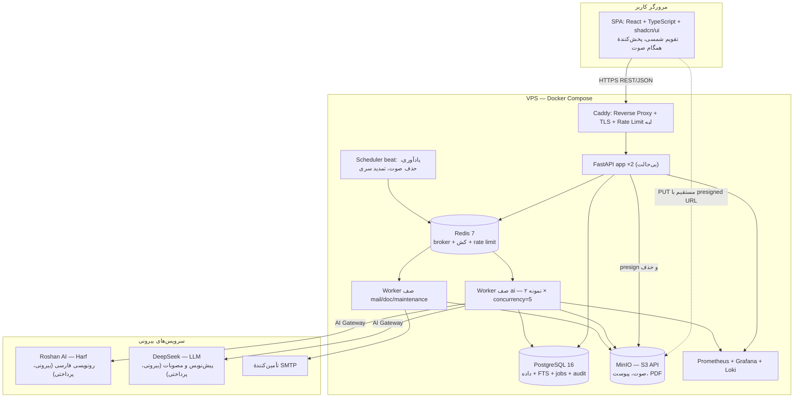
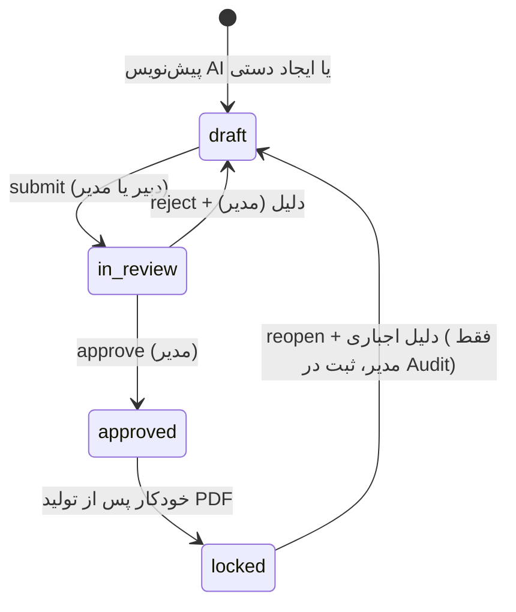
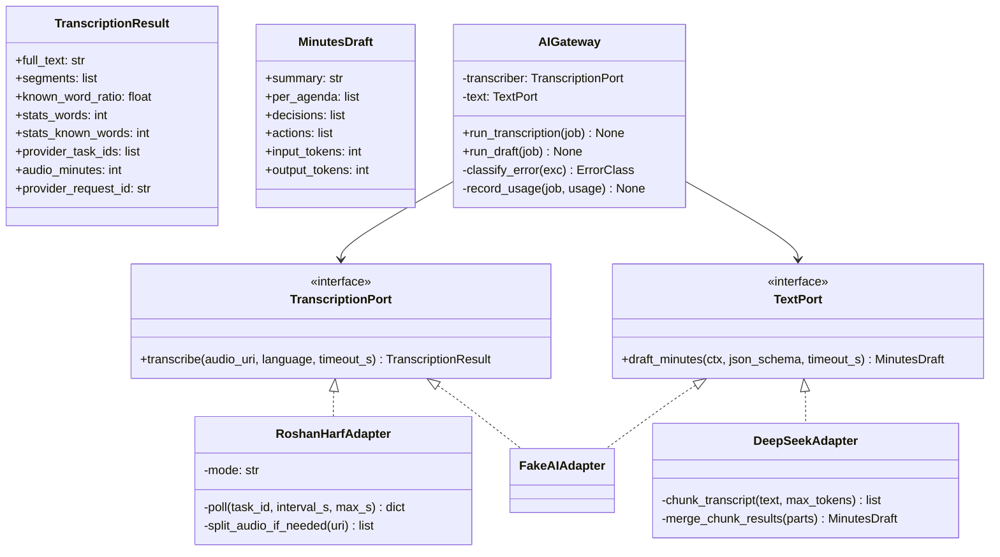
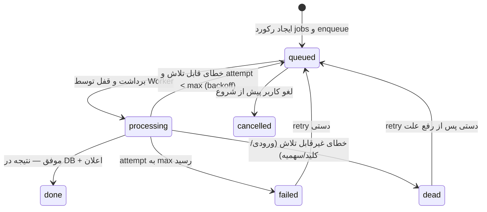
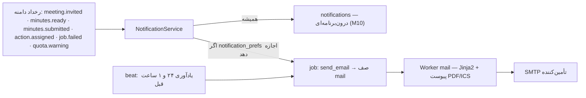
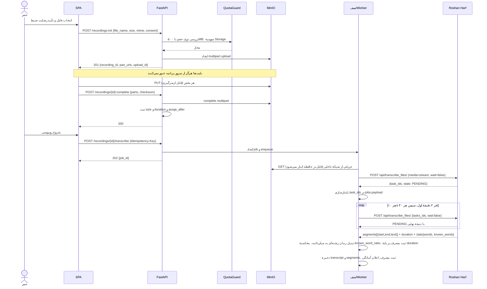
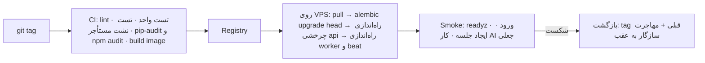
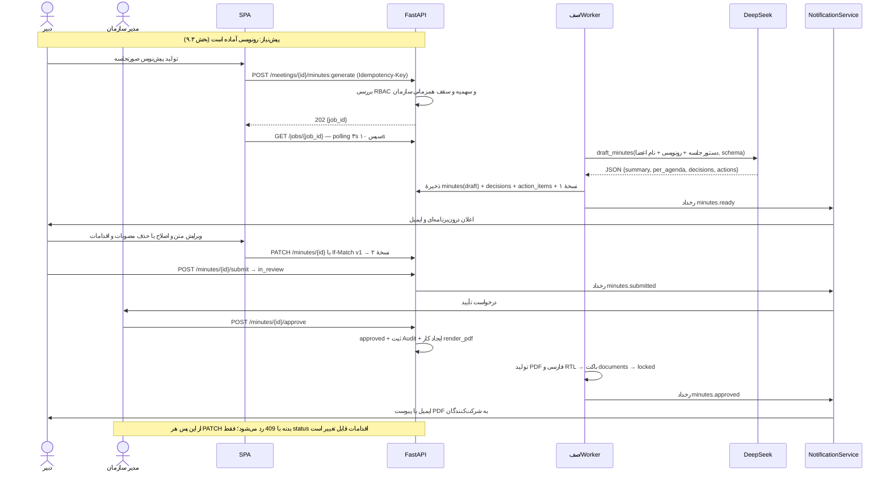
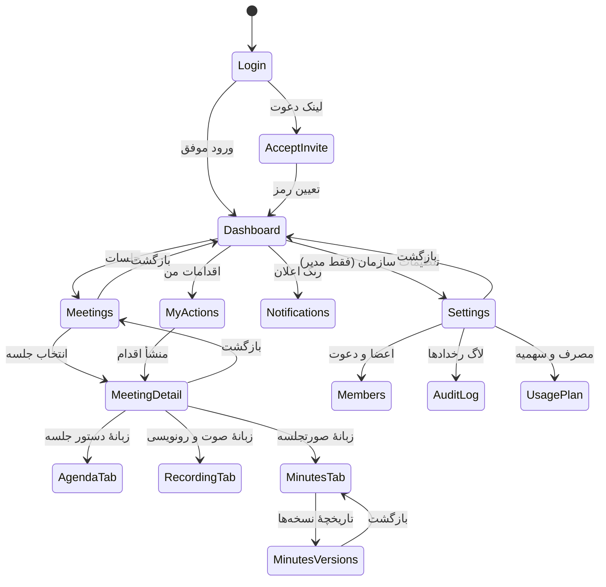

# سند معماری سیستم — سرویس SaaS مدیریت جلسات

- **نسخه:** ۱.۰ | **تاریخ:** 2026-08-17 | **تهیه‌کننده:** Bob (معمار نرم‌افزار)
- **ورودی مبنا:** `docs/mvp_feature_review.md` (بخش‌های ۵.۱، ۶.۱، ۶.۳)، `.atoms/ATOMS.md`، `.atoms/PROGRESS.md`
- **دامنه:** کامل (Full) — ۲۱ فیچر نگه‌داشته‌شده + ۱۴ فیچر جدید (M1–M14)
- **ظرفیت هدف:** ۱۰۰ کاربر همزمان، ۲۰–۳۰ RPS خواندن، ۲–۵ RPS نوشتن، ۵ آپلود همزمان، ۱۰ کار AI همزمان (۳ در هر سازمان)
- **زبان/جهت:** فارسی و RTL | **ذخیرهٔ زمان:** UTC | **نمایش:** تقویم شمسی

> این فاز فقط مستندسازی است؛ هیچ کدنویسی انجام نشده است.

---

## ۱. رویکرد پیاده‌سازی و اصول طراحی

### ۱.۱ چهار چالش سختی که معماری حول آن‌ها شکل گرفته

| # | چالش | چرا دشوار است | پاسخ معماری |
|---|---|---|---|
| C1 | جداسازی دادهٔ چندمستأجری | یک کوئری فراموش‌شده = نشت داده = خروج از بازار سازمانی | `organization_id` در همهٔ جداول دامنه + **دو لایهٔ اجبار**: Repository اجباری در کد و **RLS** پایگاه داده (۴.۳) |
| C2 | وابستگی هستهٔ ارزش به API بیرونی کند و ناپایدار | رونویسی صوت یک‌ساعته چند دقیقه طول می‌کشد؛ ۴۲۹ و قطعی رخداد روزمره است | همه روی **صف پایدار** با وضعیت مشاهده‌پذیر، timeout، retry نمایی، DLQ و سقف همزمانی دو سطحی (بخش ۶) |
| C3 | فایل صوتی تا ۵۰۰MB | عبور بایت‌ها از سرور برنامه، حافظه و پهنای باند را اشباع و ۱۰۰ کاربر خواننده را قربانی می‌کند | **آپلود مستقیم به Storage با presigned multipart URL**؛ سرور فقط مجوز و متادیتا (۹.۳) |
| C4 | فارسی: جست‌وجو، تاریخ شمسی، PDF راست‌به‌چپ | «تصميم» و «تصمیم» دو رشتهٔ متفاوت‌اند؛ کبیسه و ۳۰ اسفند؛ شکل‌دهی حروف در PDF | تابع نرمال‌سازی `IMMUTABLE` + ایندکس GIN؛ تبدیل تاریخ فقط در مرز UI؛ WeasyPrint + Vazirmatn (۳.۳) |

### ۱.۲ اصول حاکم

۱. **جدایی کامل مسیر همزمان و غیرهمزمان** — هیچ عملیات وابسته به سرویس بیرونی (AI، ایمیل، PDF) در چرخهٔ HTTP اجرا نمی‌شود؛ API فقط `job_id` برمی‌گرداند (الزام ۶.۳-الف).
۲. **مونولیت ماژولار، نه میکروسرویس** — با این بار و تیم ۳ نفره، مرزهای ماژولی درون یک کدبِیس هزینهٔ عملیاتی صفر و انسجام تراکنشی کامل می‌دهد. جداسازی فقط بین **API** و **Worker** است، چون پروفایل منابعشان متفاوت است.
۳. **PostgreSQL تا جای ممکن** — جست‌وجو (FTS)، تجمیع داشبورد، Audit و وضعیت کار همه در Postgres؛ موتور جست‌وجوی جدا در MVP اضافه نمی‌شود.
۴. **همه چیز idempotent است** — ایجاد کار AI، ایمیل و پذیرش دعوت با کلید یگانگی محافظت می‌شوند.
۵. **هر تصمیم امنیتی در لایهٔ API** — UI فقط پنهان می‌کند؛ سرور با ۴۰۳/۴۰۴/۴۰۹ رد می‌کند.
۶. **زمان: ذخیره و محاسبه UTC، نمایش شمسی** — هیچ تاریخ شمسی در پایگاه داده ذخیره نمی‌شود.

---

## ۲. نمای کلی و دیاگرام اجزا



**ماژول‌های Backend (چهار لایه، وابستگی یک‌طرفه از بالا به پایین):**

| لایه | اجزا |
|---|---|
| ورودی (Routers) | `auth` · `org/members/invites` · `meetings/agenda/rsvp` · `recordings/transcripts` · `minutes/decisions/actions` · `search/dashboard/notifications` · `admin` |
| میان‌بُر | `RequestContext(request_id, org_id, user, role)` · `AuthN(JWT)` · `AuthZ(RBAC)` · `TenantSession(SET LOCAL)` · `RateLimiter` · `QuotaGuard` · `AuditRecorder` |
| سرویس دامنه | `MeetingService` · `MinutesService` (ماشین وضعیت و نسخه‌بندی) · `ActionService` · `RecordingService` · `JobService` · `NotificationService` · `QuotaService` · `SearchService` · `DocumentService` (PDF/ICS) |
| زیرساخت | `TenantRepository` (SQLModel) · `StorageClient` (S3) · `AIGateway` (TranscriptionPort/TextPort) · `MailSender` · `CacheClient` |

لایهٔ سرویس به FastAPI وابسته نیست (قابل تست بدون HTTP) و هرگز مستقیماً SDK تأمین‌کنندهٔ AI را صدا نمی‌زند.

---

## ۳. پشتهٔ فنی و دلیل انتخاب

| لایه | انتخاب | دلیل انتخاب | گزینهٔ رد‌شده |
|---|---|---|---|
| Frontend | React 18 + TypeScript + Vite | بیلد استاتیک قابل سرو با Caddy، اکوسیستم RTL بالغ | Next.js — نیاز به Node runtime و SSR بدون سود برای اپ پشت لاگین |
| UI | shadcn/ui + Tailwind | کد در اختیار ما است و RTLسازی کامل ممکن است | MUI — سنگین و سخت‌سازگار با طراحی فارسی |
| داده‌آوری | TanStack Query v5 | کش، بازآوری و polling وضعیت کار با کد حداقلی | Redux — پیچیدگی بی‌مورد |
| تاریخ شمسی | dayjs + jalaliday | تبدیل آزمون‌شده شامل کبیسه و ۳۰ اسفند (معیار پذیرش ۴) | پیاده‌سازی دستی — منبع رایج باگ |
| Backend | **FastAPI + SQLModel + Pydantic v2** | async native (مناسب I/O سنگین S3/AI/SMTP)، OpenAPI خودکار، اعتبارسنجی قوی | Django — ORM سنکرون و سنگین برای API-only |
| پایگاه داده | **PostgreSQL 16 خودمدیریت** | JSONB، FTS، RLS، `SKIP LOCKED` و پارتیشن‌بندی در یک موتور | MySQL — RLS و FTS فارسی ضعیف‌تر |
| صف | **Celery 5 + Redis** | retry نمایی، صف مجزا، سقف همزمانی، بلوغ عملیاتی | `BackgroundTasks` — با ری‌استارت کار از بین می‌رود، بدون سقف/retry و کارگر وب را بلوکه می‌کند؛ RabbitMQ — سرویس اضافه بی‌دلیل |
| وضعیت کار | جدول `jobs` در Postgres | Redis گذرا است؛ وضعیت قابل مشاهدهٔ کاربر و DLQ باید تراکنشی و پرس‌وجوپذیر باشد | Celery result backend — تاریخچه و فیلترپذیری ندارد |
| کش/Rate Limit | Redis 7 | کش کوتاه‌مدت دادهٔ کم‌تغییر (۶.۳-و) + شمارندهٔ اتمیک | کش درون‌پروسه — با ۲ نمونه ناسازگار |
| Storage | **MinIO (سازگار S3)** | self-hosted، presigned URL، SSE-S3، مهاجرت آسان به S3 | فایل‌سیستم برنامه — بدون presign و مانع بی‌حالتی |
| PDF فارسی | **WeasyPrint + Vazirmatn** | HTML/CSS با `direction: rtl` و کنترل تایپوگرافی | ReportLab — شکل‌دهی حروف فارسی دردناک؛ Puppeteer — Chromium و RAM بالا |
| ICS | icalendar | استاندارد RFC 5545 برای پیوست دعوت (M6) | — |
| ایمیل | SMTP relay + Jinja2 | نرخ تحویل ≥۹۵٪ و SPF/DKIM بر عهدهٔ تأمین‌کننده | SMTP خودمیزبان روی VPS — عملاً اسپم می‌شود |
| احراز هویت | JWT کوتاه‌عمر + Refresh چرخشی در DB | ایمیل/رمز مطابق تصمیم تأییدشده، با **ابطال فوری نشست** | JWT بدون refresh در DB — ابطال ۶۰ ثانیه‌ای غیرقابل تضمین |
| هش رمز | Argon2id | مقاوم در برابر GPU، توصیهٔ OWASP | bcrypt — سقف ۷۲ بایت |
| Proxy/TLS | **Caddy 2** | TLS خودکار، سرو SPA + پروکسی API | Nginx + certbot — گام‌های بیشتر بدون سود |
| پایش | Prometheus + Grafana + Loki + structlog | متریک صف/خطا/تأخیر و لاگ با `request_id` (M12) | ELK — RAM نامتناسب با یک VPS |
| آزمون | pytest + httpx + testcontainers؛ Vitest + Playwright | آزمون نشت مستأجر و E2E جریان AI با Adapter جعلی | — |
| آزمون بار | k6 | سناریوی ۱۰۰ کاربر مجازی ۳۰ دقیقه | JMeter — سنگین |

### ۳.۱ سرویس‌های AI (بر پایهٔ مستندات واقعی تأمین‌کننده)

| کار | سرویس | ورودی | خروجی |
|---|---|---|---|
| رونویسی فارسی + نشانهٔ زمانی (۱۱ + ۲۳) | **حرف (Roshan AI)** — `POST /api/transcribe_files/` | فایل صوتی (`media`) یا آدرس فایل (`media_urls`) | `segments[{start,end,text}]` + `duration` + `stats{words, known_words}` |
| پیش‌نویس صورتجلسه + مصوبات و اقدامات (۱۲ + ۱۴) | **DeepSeek** (`deepseek-chat`) | دستور جلسه + رونویسی + نام نمایشی اعضا | JSON: `summary`, `per_agenda`, `decisions[]`, `actions[]` در **یک فراخوان** |

> **این دو، تنها وابستگی‌های پرداختی سیستم‌اند.** کل پشتهٔ دیگر متن‌باز و خودمیزبان است.

#### ۳.۱.۱ رونویسی با «حرف» — قرارداد واقعی سرویس

پایگاه: `https://harf.roshan-ai.ir` | سند مرجع: `uploads/harf`

| موضوع | واقعیت مستندات و تصمیم ما |
|---|---|
| احراز هویت | `POST /auth/glogin/` با `username`/`password` → `access_token` (نمونهٔ `expires_in` ≈ ۳۰٫۷ میلیون ثانیه ≈ یک سال) + `refresh_token`. توکن در سرآیند `Authorization: Bearer <token>`. **اعتبارنامه فقط در متغیر محیطی Worker** (`HARF_USERNAME`, `HARF_PASSWORD`) و هرگز در نمونهٔ API یا کلاینت |
| مدیریت توکن | آداپتر توکن را در Redis با TTL برابر `expires_in` منهای ۲۴ ساعت حاشیه کش می‌کند؛ در پاسخ `401` **یک‌بار** ورود مجدد و تلاش دوباره انجام می‌شود و این تلاش از سهم `max_attempts` کار کسر نمی‌شود (خطای پیکربندی است، نه خطای کاربر) |
| Endpoint رونویسی | `POST /api/transcribe_files/` — پارامترها: `media_urls` (آرایهٔ آدرس)، `media` (آپلود مستقیم)، `wait` (پیش‌فرض `true`)، `tasks_ids` (برای پرس‌وجوی وضعیت) |
| **حالت اجرا: همیشه `wait=false`** | `wait=true` درخواست HTTP را تا پایان پردازش باز نگه می‌دارد؛ برای صوت جلسه (ده‌ها دقیقه) این یعنی اتصال طولانی که هر reverse proxy یا قطعی شبکه آن را نابود می‌کند و نتیجهٔ پرداخت‌شده از دست می‌رود. پس آداپتر همیشه `wait=false` می‌فرستد، `task_ids` را در `jobs.payload` **پایدار** می‌کند و سپس نتیجه را با polling می‌گیرد |
| **webhook وجود ندارد** | مستندات هیچ callback ارائه نمی‌دهد. بنابراین طرح «webhook + امضای درخواست» که در نسخهٔ قبلی به‌عنوان بهینه‌سازی احتمالی مطرح بود **حذف می‌شود**؛ الگوی رسمی ما polling است. مزیت جانبی: نیازی به مسیر عمومی ورودی و تأیید اصالت درخواست بیرونی نداریم |
| الگوی polling | `POST /api/transcribe_files/` با `{"tasks_ids": [...], "wait": false}`؛ فاصله: ۱۰ ثانیه در ۲ دقیقهٔ اول، سپس ۳۰ ثانیه (backoff پله‌ای برای کاهش فشار بر تأمین‌کننده)؛ سقف کل انتظار = `max(15 دقیقه, ۱٫۵ × مدت صوت)` و سپس `TIMEOUT` داخلی |
| **نحوهٔ ارسال فایل — تصمیم اصلاح‌شده** | پیش‌فرض: **`media` به‌صورت multipart جریانی (streaming) از MinIO**. دلیل: `media_urls` مستلزم آن است که فایل صوتی جلسه از اینترنت برای سرور تأمین‌کننده قابل واکشی باشد، یعنی باید MinIO را (حتی با URL امضاشده) عمومی منتشر کنیم. این با تصمیم بخش ۱۲.۱ («Storage هیچ پورت عمومی ندارد») و اصل حداقل افشای دادهٔ محرمانه در تضاد است. Worker فایل را قطعه‌قطعه می‌خواند و بدون نگه‌داشتن کل آن در حافظه ارسال می‌کند |
| گزینهٔ دوم (اختیاری) | اگر تیم عملیات آگاهانه بپذیرد، با `HARF_SEND_MODE=url` می‌توان MinIO را روی زیردامنهٔ `storage.<domain>` منتشر کرد و presigned URL با TTL ۳۰ دقیقه فرستاد (سریع‌تر و بدون مصرف پهنای باند Worker). این تنها تفاوت عملیاتی بین دو حالت است؛ `TranscriptionPort` تغییر نمی‌کند |
| قالب زمان قطعات | رشتهٔ `H:MM:SS` یا `H:MM:SS.ffffff` (نمونه: `"0:00:02"`, `"0:00:00.240000"`). آداپتر آن را با پارسر اختصاصی به **میلی‌ثانیهٔ صحیح** تبدیل می‌کند؛ هیچ رشتهٔ زمانی خام در پایگاه داده ذخیره نمی‌شود |
| مدت صوت | فیلد `duration` در پاسخ (رشته) → مبنای **سنجش مصرف سهمیه**. اگر غایب یا غیرقابل تفسیر بود، `ffprobe` محلی روی فایل اجرا می‌شود تا هیچ کاری بدون ثبت مصرف تمام نشود |
| **واژه‌های نامطمئن** | حرف هر واژه‌ای که به تشخیص آن تردید دارد را داخل **کروشه** می‌گذارد. این علامت‌گذاری حفظ می‌شود: در UI هایلایت می‌شود تا دبیر اصلاح کند، و در پرامپت مرحلهٔ پیش‌نویس صریحاً گفته می‌شود «واژه‌های داخل کروشه نامطمئن‌اند؛ مصوبه یا عدد را بر پایهٔ آن‌ها قطعی ننویس». این جایگزین کاربردی «سطح اطمینان» است |
| **سطح اطمینان عددی وجود ندارد** | سرویس `confidence` هر قطعه را برنمی‌گرداند؛ فقط `stats{words, known_words}`. بنابراین ستون `transcripts.confidence_avg` طراحی قبلی به **`known_word_ratio` (= `known_words / words`)** به‌همراه دو ستون خام `stats_words` و `stats_known_words` تغییر می‌کند. اگر نسبت < ۰٫۸ باشد، UI بنر «کیفیت رونویسی پایین است؛ پیش از تأیید بازبینی کنید» نشان می‌دهد و در ایمیل «پیش‌نویس آماده شد» هم تذکر داده می‌شود |
| **تشخیص گوینده در MVP خارج از دامنه** | مستندات diarization کور ندارد. `POST /api/speaker_tasks/indexing/` وجود دارد اما **الزاماً `target_urls` یعنی نمونهٔ صدای از پیش ثبت‌شدهٔ هر فرد** را می‌خواهد. ساخت «بانک نمونهٔ صدای اعضا» یک فیچر محصولی مستقل با بار حریم خصوصی و رضایت صریح است. پس `transcript_segments.speaker_label` به‌عنوان ستون **اختیاری و خالی** باقی می‌ماند و دبیر مسئولان اقدام را دستی تعیین می‌کند |
| حالت‌های وضعیت | `PENDING`, `FAILURE`, `TIMEOUT` و پاسخ موفق (آرایهٔ نتایج شامل `segments`). نگاشت کامل به `jobs` در بخش ۶.۴.۱ |
| سلامت سرویس | `GET /api/healthcheck/` → مبنای probe نیمه‌باز Circuit Breaker و متریک `ai_provider_up{provider="harf"}`؛ پیش از باز کردن مدار، یک probe ارزان زده می‌شود نه یک کار واقعی مشتری |
| قابلیت‌های استفاده‌نشده در MVP | `POST /api/tts/` (تبدیل متن به گفتار)، `POST /api/alignment/` (هم‌ترازی واژه‌به‌واژه)، `WS /api/ws_api/transcribe_files/wav/sync/` (رونویسی زنده)، `POST /api/speaker_tasks/verification/`. دو مورد اول و سوم فرصت روشن فاز بعد هستند: `alignment` دقت پخش همگام را از سطح قطعه به سطح واژه می‌برد و WebSocket امکان «رونویسی زندهٔ جلسه» را می‌دهد |

**تفاوت‌های اثرگذار نسبت به نسخهٔ قبلی سند (خلاصهٔ صریح):**

| # | فرض قبلی | واقعیت «حرف» | اثر |
|---|---|---|---|
| ۱ | امکان webhook به‌عنوان بهینه‌سازی فاز بعد | فقط polling | حذف طرح webhook و الزامات امنیتی آن؛ سادگی بیشتر |
| ۲ | ترجیح ارسال presigned URL | `media_urls` موجود است اما افشای Storage می‌خواهد | پیش‌فرض به آپلود جریانی از Worker تغییر کرد |
| ۳ | `confidence_avg` عددی از تأمین‌کننده | فقط `words/known_words` + کروشهٔ واژهٔ مشکوک | تغییر ستون به `known_word_ratio` + هشدار کیفیت در UI |
| ۴ | احتمال دریافت `speaker` در قطعات | نیازمند نمونهٔ صدای از پیش ثبت‌شده | انتساب گوینده از MVP خارج شد |
| ۵ | کلید API ساده در سرآیند | ورود با نام کاربری/رمز و توکن یک‌ساله | افزودن چرخهٔ ورود/کش/تجدید توکن در آداپتر |
| ۶ | زمان قطعات عددی | رشتهٔ `H:MM:SS[.ffffff]` | پارسر اختصاصی و تبدیل اجباری به میلی‌ثانیه |

**ریسک وابستگی و طرح جایگزین:** «حرف» تنها سرویس بومی با دقت قابل قبول فارسی است، اما اگر کیفیت یا نرخ آن مانع شود، `TranscriptionPort` بدون تغییر می‌ماند و فقط آداپتر دوم ساخته می‌شود؛ `TRANSCRIBE_PROVIDER` جابه‌جایی را بدون تغییر کد دامنه ممکن می‌کند. **آزمون پذیرش الزامی پیش از برش ۳:** سه فایل صوتی واقعی جلسهٔ فارسی (کیفیت خوب / نویز پس‌زمینه / چند گوینده)، سنجش نرخ خطای واژه و نسبت `known_words`؛ اگر نتیجه ضعیف بود، طرح جایگزین **پیش از** ساخت کل جریان تعیین می‌شود، نه بعد از آن.

#### ۳.۱.۲ محدودیت‌های عملیاتی و قطعه‌قطعه‌سازی صوت

مستندات **سقف حجم فایل، حداکثر مدت صوت، سقف نرخ درخواست و مدل قیمت‌گذاری را مشخص نکرده است**. این‌ها به‌عنوان ابهام باز (A8–A10 در بخش ۱۶.۲) ثبت می‌شوند و تا دریافت پاسخ رسمی، آستانه‌های **محافظه‌کارانهٔ داخلی و تنظیم‌پذیر** اعمال می‌شود تا یک درخواست بزرگ باعث رد شدن یا هزینهٔ غیرمنتظره نشود:

| کنترل داخلی | مقدار پیش‌فرض | متغیر |
|---|---|---|
| سقف حجم ارسال در یک درخواست | ۲۰۰MB | `HARF_MAX_UPLOAD_BYTES` |
| سقف مدت صوت در یک درخواست | ۹۰ دقیقه | `HARF_MAX_AUDIO_MINUTES` |
| سقف درخواست‌های همزمان به تأمین‌کننده | ۴ | `HARF_MAX_INFLIGHT` |
| فاصلهٔ polling | ۱۰s سپس ۳۰s | `HARF_POLL_INTERVALS` |

**قطعه‌قطعه‌سازی (chunking):** اگر فایل از آستانه‌های بالا عبور کند، Worker با `ffmpeg` آن را روی **مرز سکوت** به قطعات ≤۹۰ دقیقه تقسیم می‌کند، هر قطعه یک `task_id` جداگانه می‌گیرد، و در ادغام، زمان هر قطعه با `offset` تجمعی جابه‌جا می‌شود تا نشانه‌های زمانی نهایی با فایل اصلی منطبق بمانند. `stats` قطعات جمع و `known_word_ratio` وزنی محاسبه می‌شود. `ffmpeg` (آزاد) به ایمیج Worker اضافه می‌شود و **فقط در Worker** حضور دارد.

#### ۳.۱.۳ تولید متن با DeepSeek

| موضوع | تصمیم |
|---|---|
| Endpoint | سازگار با OpenAI (`/chat/completions`) با `response_format` نوع JSON؛ کلید در `DEEPSEEK_API_KEY` فقط در Worker |
| ورودی | دستور جلسه + رونویسی (با حفظ کروشه‌های نامطمئن) + نام نمایشی اعضا؛ **هیچ ایمیل، تلفن یا شناسهٔ داخلی ارسال نمی‌شود** |
| خروجی | JSON با اسکیمای ثابت `{summary, per_agenda[], decisions[], actions[]}`؛ پاسخ نامنطبق با اسکیما = خطای `fatal_input` پس از یک بازتلاش با پیام اصلاحی |
| قطعه‌بندی متن بلند | مطابق بخش ۶.۲ (قطعات ~۶٬۰۰۰ کلمه با همپوشانی و ادغام) |
### ۳.۲ چرا آپلود مستقیم اجباری است

با سقف ۵۰۰MB و ۵ آپلود همزمان، عبور بایت‌ها از FastAPI تا ۲٫۵GB داده در جریان در همان پروسه‌ای است که باید ۳۰ RPS خواندن را پاسخ دهد. جریان: `POST /recordings:init` (بررسی سهمیه + صدور presigned multipart URL) → آپلود مرورگر به MinIO → `POST /recordings/{id}:complete`. سرور هرگز بایت صوت را نمی‌بیند.

### ۳.۳ نرمال‌سازی فارسی، تاریخ و PDF

```sql
CREATE FUNCTION fa_normalize(txt text) RETURNS text
LANGUAGE sql IMMUTABLE STRICT PARALLEL SAFE AS $$
  SELECT lower(regexp_replace(
    translate(txt, 'يكآإأؤةۀى', 'یکاااهه'),
    '[\u064B-\u0652\u0640\u200C]|\s+', ' ', 'g'));
$$;
CREATE INDEX idx_minutes_fts ON minutes
  USING GIN (to_tsvector('simple', fa_normalize(body_markdown)));
```

همان تابع روی کوئری کاربر هم اجرا می‌شود، پس «تصميم»، «تصمیم» و «تصمیم‌گیری» نتیجهٔ یکسان می‌دهند (معیار پذیرش ۱۶)؛ رتبه‌بندی با `ts_rank` و فیلتر اجباری `organization_id`. تبدیل شمسی↔میلادی فقط در مرز UI و قالب‌های ایمیل/PDF انجام می‌شود؛ PDF در باکت `documents` کش می‌شود تا درخواست دوم بدون رندر پاسخ بگیرد.

---

## ۴. مدل دادهٔ چندمستأجری و ERD

### ۴.۱ راهبرد

| گزینه | ارزیابی | تصمیم |
|---|---|---|
| اسکیما به‌ازای هر مستأجر | مهاجرت در N سازمان، پیچیدگی عملیاتی بالا | رد |
| پایگاه داده به‌ازای هر مستأجر | هزینهٔ اتصال و پشتیبان‌گیری غیرقابل توجیه در MVP | رد |
| **ستون `organization_id` مشترک + RLS** | ساده، مهاجرت واحد، امنیت قابل قبول با دفاع عمقی | **پذیرش** |

### ۴.۲ ERD

```mermaid
erDiagram
    ORGANIZATIONS ||--o{ USERS : "دارد"
    ORGANIZATIONS ||--o{ INVITATIONS : "صادر می‌کند"
    ORGANIZATIONS }o--|| PLANS : "پلن"
    ORGANIZATIONS ||--o{ USAGE_COUNTERS : "مصرف ماهانه"
    ORGANIZATIONS ||--o{ MEETING_TYPES : "انواع جلسه"
    ORGANIZATIONS ||--o{ MEETINGS : "جلسات"
    ORGANIZATIONS ||--o{ AUDIT_LOGS : "رخدادها"
    ORGANIZATIONS ||--o{ JOBS : "کارها"
    USERS ||--o{ REFRESH_SESSIONS : "نشست‌ها"
    USERS ||--o{ NOTIFICATIONS : "اعلان‌ها"
    USERS ||--o{ ACTION_ITEMS : "مسئولیت"
    MEETING_TYPES ||--o{ MEETINGS : "نوع"
    MEETING_TYPES ||--o{ AGENDA_TEMPLATE_ITEMS : "قالب"
    RECURRENCE_SERIES ||--o{ MEETINGS : "نمونه‌ها"
    MEETINGS ||--o{ AGENDA_ITEMS : "دستور جلسه"
    MEETINGS ||--o{ PARTICIPANTS : "دعوت‌شدگان"
    MEETINGS ||--o{ RECORDINGS : "فایل صوتی"
    MEETINGS ||--o| MINUTES : "صورتجلسه"
    AGENDA_ITEMS ||--o{ ATTACHMENTS : "پیوست"
    RECORDINGS ||--o| TRANSCRIPTS : "رونویسی"
    TRANSCRIPTS ||--o{ TRANSCRIPT_SEGMENTS : "قطعات زمان‌دار"
    MINUTES ||--o{ MINUTE_VERSIONS : "نسخه‌ها"
    MINUTES ||--o{ DECISIONS : "مصوبات"
    MINUTES ||--o{ ACTION_ITEMS : "اقدامات"
    DECISIONS ||--o{ ACTION_ITEMS : "منشأ"
    JOBS ||--o{ JOB_ATTEMPTS : "تلاش‌ها"
    JOBS ||--o| AI_USAGE_EVENTS : "مصرف"

    ORGANIZATIONS {
        uuid id PK
        varchar name
        varchar slug UK
        varchar timezone "پیش‌فرض Asia/Tehran"
        int audio_retention_days "پیش‌فرض ۹۰ — Q3"
        uuid plan_id FK
        varchar status "active|suspended"
    }
    PLANS {
        uuid id PK
        int max_active_users "۲۵ — Q4"
        int monthly_transcription_minutes "۱۲۰۰ — Q4"
        bigint max_storage_bytes
        bigint max_upload_bytes "۵۰۰MB"
        int max_concurrent_ai_jobs "۳"
    }
    USAGE_COUNTERS {
        uuid id PK
        uuid organization_id FK
        varchar period "YYYY-MM به UTC"
        int transcription_minutes_used
        bigint storage_bytes_used
    }
    USERS {
        uuid id PK
        uuid organization_id FK
        varchar email UK
        varchar password_hash "argon2id"
        varchar full_name
        varchar role "org_admin|secretary|member"
        varchar status "active|disabled|pending"
        jsonb notification_prefs
        timestamptz locked_until
    }
    INVITATIONS {
        uuid id PK
        uuid organization_id FK
        varchar email
        varchar role
        varchar token_hash UK
        timestamptz expires_at "۷۲ ساعت"
        varchar status "pending|accepted|revoked|expired"
    }
    REFRESH_SESSIONS {
        uuid id PK
        uuid user_id FK
        varchar token_hash UK
        timestamptz last_seen_at "پایهٔ انقضای ۳۰ دقیقه"
        timestamptz absolute_expires_at "۱۲ ساعت"
        timestamptz revoked_at
    }
    MEETING_TYPES {
        uuid id PK
        uuid organization_id FK
        varchar name "هیئت‌مدیره|عملیاتی|پروژه‌ای"
        int quorum_percent "M13"
    }
    AGENDA_TEMPLATE_ITEMS {
        uuid id PK
        uuid organization_id FK
        uuid meeting_type_id FK
        int position
        varchar title
        int planned_minutes
    }
    RECURRENCE_SERIES {
        uuid id PK
        uuid organization_id FK
        varchar frequency "daily|weekly|monthly"
        int interval_count
        jsonb weekdays
        int materialized_count "حداکثر ۱۲"
    }
    MEETINGS {
        uuid id PK
        uuid organization_id FK
        uuid meeting_type_id FK
        uuid recurrence_series_id FK
        varchar title
        text description
        timestamptz starts_at_utc
        int duration_minutes "۵..۴۸۰"
        varchar location
        varchar online_url
        uuid secretary_user_id FK "یک دبیر — Q2"
        varchar status "scheduled|held|cancelled"
        int version "قفل خوشبینانه"
    }
    AGENDA_ITEMS {
        uuid id PK
        uuid organization_id FK
        uuid meeting_id FK
        int position
        varchar title
        text notes
        int planned_minutes
        uuid owner_user_id FK
    }
    ATTACHMENTS {
        uuid id PK
        uuid organization_id FK
        uuid agenda_item_id FK
        varchar object_key
        varchar mime_type
        bigint size_bytes
    }
    PARTICIPANTS {
        uuid id PK
        uuid organization_id FK
        uuid meeting_id FK
        uuid user_id FK
        varchar rsvp_status "pending|accepted|declined|tentative"
        text rsvp_note
        boolean attended "حضور واقعی — M13"
    }
    RECORDINGS {
        uuid id PK
        uuid organization_id FK
        uuid meeting_id FK
        varchar object_key
        varchar upload_status "initiated|uploaded|failed"
        bigint size_bytes
        int duration_seconds
        varchar checksum_sha256
        timestamptz consent_ack_at "رضایت ضبط — M7"
        timestamptz purge_after "چرخهٔ عمر — M7"
        timestamptz deleted_at
    }
    TRANSCRIPTS {
        uuid id PK
        uuid organization_id FK
        uuid recording_id FK
        text full_text
        numeric known_word_ratio "known_words / words — جانشین confidence"
        int stats_words
        int stats_known_words
        int duration_seconds "از فیلد duration پاسخ حرف"
        jsonb provider_task_ids "task_ids حرف برای polling و retry"
        uuid job_id FK
    }
    TRANSCRIPT_SEGMENTS {
        uuid id PK
        uuid organization_id FK
        uuid transcript_id FK
        int start_ms
        int end_ms
        text text
    }
    MINUTES {
        uuid id PK
        uuid organization_id FK
        uuid meeting_id FK "یگانه"
        varchar status "draft|in_review|approved|locked"
        text body_markdown
        text summary
        int current_version
        uuid approved_by FK
        timestamptz approved_at
        text reopen_reason
        varchar pdf_object_key
    }
    MINUTE_VERSIONS {
        uuid id PK
        uuid organization_id FK
        uuid minutes_id FK
        int version_no
        text body_markdown
        uuid edited_by FK
    }
    DECISIONS {
        uuid id PK
        uuid organization_id FK
        uuid minutes_id FK
        uuid agenda_item_id FK
        text text
        varchar source "ai|manual"
    }
    ACTION_ITEMS {
        uuid id PK
        uuid organization_id FK
        uuid minutes_id FK
        uuid decision_id FK
        varchar title
        uuid assignee_user_id FK "خالی مجاز"
        date due_date
        varchar status "open|in_progress|done|cancelled"
        varchar source "ai|manual"
    }
    NOTIFICATIONS {
        uuid id PK
        uuid organization_id FK
        uuid user_id FK
        varchar type
        varchar title
        varchar link_path
        timestamptz read_at
    }
    JOBS {
        uuid id PK
        uuid organization_id FK
        varchar job_type "transcribe|draft_minutes|send_email|render_pdf|purge_audio|org_export"
        varchar status "queued|processing|done|failed|dead|cancelled"
        varchar idempotency_key UK
        varchar subject_type
        uuid subject_id
        jsonb payload
        jsonb result
        varchar error_code
        text error_message_fa
        int attempt_count
        int max_attempts "۳"
        timestamptz next_retry_at
        timestamptz started_at
    }
    JOB_ATTEMPTS {
        uuid id PK
        uuid job_id FK
        int attempt_no
        varchar outcome "success|retryable|fatal|timeout"
        int duration_ms
        varchar provider_request_id
        text error_detail
    }
    AI_USAGE_EVENTS {
        uuid id PK
        uuid organization_id FK
        uuid job_id FK
        varchar provider "roshan_harf|deepseek"
        varchar model
        int audio_minutes
        int input_tokens
        int output_tokens
        numeric estimated_cost
    }
    AUDIT_LOGS {
        bigint id PK
        uuid organization_id FK
        uuid actor_user_id FK
        varchar actor_ip
        varchar action
        varchar entity_type
        uuid entity_id
        jsonb metadata "بدون دادهٔ حساس"
        varchar request_id
        timestamptz created_at "پارتیشن ماهانه"
    }
```



### ۴.۳ اجبار دو لایه‌ای جداسازی مستأجر

**لایهٔ ۱ — کد.** همهٔ موجودیت‌های دامنه از `TenantMixin` ارث می‌برند و دسترسی فقط از `TenantRepository` است که `organization_id` را از `RequestContext` گرفته و به هر `select/update/delete` تزریق می‌کند. کوئری خام در لایهٔ سرویس ممنوع و با قاعدهٔ lint در CI بررسی می‌شود.

**لایهٔ ۲ — پایگاه داده (RLS، دفاع عمقی).**

```sql
ALTER TABLE meetings ENABLE ROW LEVEL SECURITY;
CREATE POLICY tenant_isolation ON meetings
  USING (organization_id = current_setting('app.current_org')::uuid);
```

Middleware در ابتدای هر تراکنش `SET LOCAL app.current_org = :org_id` اجرا می‌کند؛ اگر فیلتری در کد فراموش شود، پایگاه داده صفر ردیف برمی‌گرداند.

| نقش DB | RLS | استفاده |
|---|---|---|
| `app_tenant` | فعال (بدون BYPASSRLS) | API و Worker در مسیر مستأجر |
| `app_platform` | BYPASSRLS | فقط کنسول پلتفرم و مهاجرت (بخش ۱۰) |

**آزمون پذیرش الزامی (M2):** CI دو سازمان با داده می‌سازد و هر endpoint را با توکن سازمان دیگر صدا می‌زند؛ خروجی مورد انتظار ۴۰۴/۴۰۳ و صفر ردیف نشت.

### ۴.۴ ایندکس‌های الزامی (۶.۳-ه)

| جدول | ایندکس | هدف |
|---|---|---|
| meetings | `(organization_id, starts_at_utc DESC)` و `(organization_id, status, starts_at_utc)` | فهرست جلسات، تفکیک آینده/گذشته |
| participants | `(organization_id, user_id, rsvp_status)` | «جلسات من» |
| action_items | `(organization_id, assignee_user_id, status, due_date)` | «اقدامات من» و معوق‌ها |
| minutes | `(organization_id, status)` | صف تأیید در داشبورد |
| minutes / meetings | GIN روی `fa_normalize(...)` | جست‌وجوی متنی فارسی |
| jobs | `(organization_id, status, created_at)` , `(status, next_retry_at)` , UNIQUE `idempotency_key` | صف، DLQ، پایش، ضدتکرار |
| audit_logs | `(organization_id, created_at DESC)` + پارتیشن ماهانه | نمای مدیر |
| usage_counters | UNIQUE `(organization_id, period)` | شمارش اتمیک سهمیه |

### ۴.۵ یکپارچگی و همروندی

- **قفل خوشبینانه** روی `minutes` و `meetings/agenda_items` با ستون `version` و سرآیند `If-Match` → تعارض = `409` با پیام «این سند توسط کاربر دیگری تغییر کرده است».
- **قفل نهایی صورتجلسه:** در `approved/locked` هر نوشتن با `409` رد می‌شود؛ تنها `status` اقدامات پس از تأیید قابل تغییر است (پیگیری اجرا).
- **حذف نرم:** کاربر (`status=disabled`) و صوت (`deleted_at`) از جدول حذف نمی‌شوند تا صورتجلسه‌های تاریخی معتبر بمانند؛ در صوت **آبجکت** حذف می‌شود ولی متادیتا برای Audit می‌ماند.
- **غیرفعال‌سازی عضو (Q7):** در یک تراکنش، ابطال همهٔ `refresh_sessions` + انتقال اقدامات باز به `assignee=NULL` + اعلان به مدیر.

---

## ۵. قراردادهای REST API و ماتریس RBAC

### ۵.۱ قواعد عمومی

| موضوع | قاعده |
|---|---|
| پیشوند | `/api/v1` |
| احراز هویت | `Authorization: Bearer <access_jwt>` (۱۵ دقیقه)؛ تازه‌سازی با کوکی `HttpOnly; Secure; SameSite=Strict` |
| مستأجر | **هرگز از کلاینت گرفته نمی‌شود**؛ `organization_id` فقط از توکن |
| صفحه‌بندی | `?page=1&page_size=20` (سقف ۱۰۰) → `{items, total, page, page_size}` |
| مرتب‌سازی | `?sort=starts_at:asc` با فهرست سفید فیلدها |
| قالب خطا | `{"error": {"code", "message_fa", "details", "request_id"}}` |
| زمان | ISO-8601 با `Z` (UTC)؛ تبدیل شمسی فقط در UI |
| Idempotency | سرآیند `Idempotency-Key` روی ایجاد کار AI و ارسال ایمیل |
| نسخهٔ منبع | `If-Match: <version>` روی ویرایش صورتجلسه و دستور جلسه |

### ۵.۲ فهرست Endpointها

| گروه | متد و مسیر | توضیح |
|---|---|---|
| احراز هویت | `POST /auth/register` | ثبت‌نام اولین کاربر + **ایجاد خودکار سازمان** (M2) + پذیرش شرایط (M14) |
| | `POST /auth/login` | ۵ خطا در ۱۵ دقیقه → `423 Locked` |
| | `POST /auth/refresh` | چرخش توکن؛ بازاستفادهٔ توکن سوخته → ابطال کل خانوادهٔ نشست |
| | `POST /auth/logout` , `/auth/forgot-password` , `/auth/reset-password` | توکن ۳۰ دقیقه‌ای یک‌بارمصرف |
| حساب | `GET/PATCH /me` , `POST /me/change-password` | پروفایل، منطقهٔ زمانی، `notification_prefs` (M9) |
| سازمان | `GET/PATCH /org` , `GET /org/usage` | تنظیمات و مصرف/سقف پلن (M4) |
| اعضا | `GET /org/members` , `PATCH /org/members/{id}` | فهرست، تغییر نقش، `disable` نرم |
| دعوت | `POST /org/invitations` , `POST .../resend` , `DELETE .../{id}` , `POST /invitations/accept` | آخری عمومی: توکن + تعیین رمز → عضو `active` (M1) |
| حاکمیت | `GET /org/audit-logs` , `GET /org/export` | Audit با فیلتر (M5)؛ خروجی دادهٔ سازمان غیرهمزمان (M14) |
| انواع جلسه | `GET/POST /meeting-types` | سه نوع پیش‌ساخته + `quorum_percent` |
| جلسات | `GET /meetings?from&to&type&status&q&scope=mine` | فهرست صفحه‌بندی‌شده، پیش‌فرض «نزدیک‌ترین جلسه» |
| | `POST /meetings` , `GET/PATCH/DELETE /meetings/{id}` | `recurrence` اختیاری (≤۱۲ نمونه)؛ `?scope=series` |
| دستور جلسه | `GET/PUT /meetings/{id}/agenda` , `POST /agenda-items/{id}/attachments:init` و `:complete` | ذخیره با `If-Match`؛ پیوست با presigned URL |
| حضور | `GET/POST /meetings/{id}/participants` , `POST /meetings/{id}/rsvp` , `POST /meetings/{id}/attendance` | RSVP سه‌حالته + یادداشت (Q1)؛ حضور واقعی و حد نصاب (M13) |
| تقویم | `GET /meetings/{id}/ics` | فایل ICS (M6) |
| صوت | `POST /meetings/{id}/recordings:init` , `POST /recordings/{id}:complete` | اعتبارسنجی نوع/حجم + سهمیه → presigned multipart |
| | `GET /recordings/{id}/download-url` , `DELETE /recordings/{id}` | URL ۱۵ دقیقه‌ای + ثبت Audit؛ حذف صوت با حفظ متن (M7) |
| رونویسی | `POST /recordings/{id}/transcribe` → `202 {job_id}` , `GET /transcripts/{id}` , `PATCH /transcripts/{id}/segments/{sid}` | متن + قطعات زمان‌دار برای پخش همگام؛ اصلاح دستی |
| صورتجلسه | `POST /meetings/{id}/minutes:generate` → `202 {job_id}` | تولید پیش‌نویس + مصوبات در یک کار |
| | `GET/PATCH /minutes/{id}` , `GET /minutes/{id}/versions` , `GET /minutes/{id}/diff?a=&b=` | هر ذخیره یک نسخه؛ تاریخچه و تفاوت (M3) |
| | `POST /minutes/{id}/submit|approve|reject|reopen` , `GET /minutes/{id}/pdf` | گذارهای وضعیت؛ PDF فارسی/RTL کش‌شده |
| مصوبات/اقدامات | `CRUD /minutes/{id}/decisions` , `GET/POST/PATCH /actions` | مصوبات قابل ویرایش **پیش از** تأیید؛ `?assignee=me&overdue=true` |
| کارها | `GET /jobs/{id}` , `GET /jobs?status=failed` , `POST /jobs/{id}/retry` | وضعیت و نوبت صف؛ نمای DLQ مدیر؛ تلاش مجدد |
| اعلان/جست‌وجو/داشبورد | `GET /notifications?unread=true` , `POST /notifications/read-all` , `GET /search?q=&type=` , `GET /dashboard/summary` | M10؛ FTS نرمال‌شده؛ سه کارت + سه فهرست |

### ۵.۳ ماشین وضعیت صورتجلسه (M3)



### ۵.۴ ماتریس RBAC (سه نقش ثابت مستأجر)

| قابلیت | org_admin | secretary | member | پاسخ در نبود مجوز |
|---|---|---|---|---|
| تنظیمات سازمان، لوگو، سیاست نگه‌داری صوت | ✅ | ❌ | ❌ | 403 `FORBIDDEN_ROLE` |
| دعوت/لغو دعوت، تغییر نقش، غیرفعال‌سازی عضو | ✅ | ❌ | ❌ | 403 |
| مشاهدهٔ Audit Log و مصرف سهمیه | ✅ | ❌ | ❌ | 403 |
| مدیریت انواع جلسه و حد نصاب | ✅ | ❌ | ❌ | 403 |
| ایجاد/ویرایش/لغو جلسه | ✅ همه | ✅ جلسات خود یا دبیرِ آن | ❌ | 403 |
| ویرایش دستور جلسه و پیوست | ✅ | ✅ جلسهٔ خود | ❌ | 403 |
| مشاهدهٔ جلسه و دستور جلسه | ✅ | ✅ | ✅ اگر دعوت‌شده | **404** (پنهان‌سازی وجود منبع) |
| پاسخ RSVP | ✅ | ✅ | ✅ فقط خود | 403 |
| ثبت حضور واقعی | ✅ | ✅ | ❌ | 403 |
| آپلود/دانلود/حذف صوت | ✅ | ✅ جلسهٔ خود | ❌ | 403 |
| ایجاد کار رونویسی و تولید پیش‌نویس | ✅ | ✅ | ❌ | 403 |
| ویرایش صورتجلسه در `draft/in_review` | ✅ | ✅ دبیر همان جلسه | ❌ | 403 |
| `submit` صورتجلسه | ✅ | ✅ | ❌ | 403 |
| `approve` / `reject` | ✅ | ❌ | ❌ | 403 `APPROVAL_REQUIRES_ADMIN` |
| `reopen` سند قفل‌شده | ✅ با دلیل | ❌ | ❌ | 403 |
| مشاهدهٔ صورتجلسهٔ تأییدشده و PDF | ✅ | ✅ | ✅ اگر شرکت‌کننده | 404 |
| تغییر وضعیت اقدام | ✅ | ✅ | ✅ فقط اقدام خودش | 403 |
| تخصیص اقدام به دیگری | ✅ | ✅ | ❌ | 403 |
| تلاش مجدد کار شکست‌خورده | ✅ | ✅ کار خودش | ❌ | 403 |

**قاعدهٔ ۴۰۳ در برابر ۴۰۴:** اگر «وجودِ» منبع خودش اطلاعات محرمانه است (جلسه‌ای که کاربر در آن نیست) پاسخ **۴۰۴** است تا شمارش منابع سازمان ممکن نشود؛ اگر کاربر می‌داند منبع وجود دارد ولی مجوز عمل ندارد (مثل `approve`) پاسخ **۴۰۳** با `code` مشخص است تا UI پیام دقیق فارسی بدهد.

**پیاده‌سازی:** یک dependency واحد `require(permission, resource_loader)` که نقش، عضویت/مالکیت و وضعیت منبع را بررسی و در عملیات حساس رخداد Audit ثبت می‌کند. هیچ کنترل دسترسی دستی در Router نوشته نمی‌شود.

---

## ۶. لایهٔ AI Gateway، صف کار، وضعیت، timeout/retry/DLQ

### ۶.۱ ساختار Gateway (الزام ۶.۳-ج)



سه فایده: جایگزینی تأمین‌کننده بدون تغییر دامنه، mock بدون هزینه در تست، و اعمال **متمرکز** سیاست retry/timeout/سقف هزینه.

### ۶.۲ قطعه‌بندی متن بلند (معیار پذیرش ۱۲ — تا ۲۰٬۰۰۰ کلمه)

۱. تقسیم به قطعات ~۶٬۰۰۰ کلمه با ۲۰۰ کلمه همپوشانی، ترجیحاً روی **مرز آیتم دستور جلسه**.
۲. پردازش هر قطعه با همان اسکیمای JSON.
۳. ادغام: حذف مصوبات تکراری، اتحاد اقدامات هم‌مسئول/هم‌موضوع، و یک فراخوان کوتاه نهایی فقط برای `summary` کل جلسه.
۴. بیش از ۶ قطعه → رد با `INPUT_TOO_LONG` و پیام فارسی (پیشگیری از هزینهٔ انفجاری).

### ۶.۳ چرخهٔ عمر کار



### ۶.۴ سیاست timeout، retry و DLQ

| نوع کار | صف | timeout هر تلاش | max_attempts | backoff | هدف |
|---|---|---|---|---|---|
| `transcribe` (ارسال به حرف + polling) | `ai` | سقف انتظار `max(۱۵ دقیقه, ۱٫۵× مدت صوت)`؛ kill سخت ۵ دقیقه بعد از آن | ۳ | ۳۰s → ۲m → ۸m + jitter ۰–۳۰s | ≤۰٫۵× مدت صوت. **در retry، اگر `task_ids` در `jobs.payload` موجود باشد فایل دوباره ارسال نمی‌شود و فقط polling ادامه می‌یابد** — این مهم‌ترین محافظ در برابر پرداخت دوبارهٔ هزینهٔ یک رونویسی است |
| `draft_minutes` | `ai` | ۵ دقیقه | ۳ | ۳۰s → ۲m → ۸m | ≤۳ دقیقه |
| `send_email` | `mail` | ۳۰ ثانیه | ۳ | ۱m → ۵m → ۲۵m | ورود به صف ≤۶۰ ثانیه |
| `render_pdf` | `doc` | ۶۰ ثانیه | ۲ | ۳۰s | محلی |
| `purge_audio` | `maintenance` | ۵ دقیقه | ۳ | ۱۰m | روزانه با beat |
| `org_export` | `doc` | ۱۰ دقیقه | ۲ | ۵m | M14 |

| کلاس خطا | نمونه | رفتار |
|---|---|---|
| `retryable_transient` | ۴۲۹، ۵۰۰–۵۰۴، timeout، قطع اتصال | retry با backoff؛ در ۴۲۹ اگر `Retry-After` آمد همان مقدار |
| `fatal_input` | فرمت نامعتبر، صوت خالی، `INPUT_TOO_LONG` | مستقیم `dead` + پیام راهنمای فارسی، بدون سوزاندن تلاش |
| `fatal_auth` | ۴۰۱/۴۰۳ تأمین‌کننده (کلید منقضی) | مستقیم `dead` + **هشدار فوری به عملیات** (خطای پیکربندی، نه خطای کاربر) |
| `fatal_quota` | اتمام سهمیهٔ سازمان | `dead` با پیام «سهمیهٔ ماهانه تمام شده است» + لینک صفحهٔ مصرف |

**DLQ به‌صورت وضعیت داده‌ای، نه صف Redis جدا:** رکوردهای `jobs.status IN ('failed','dead')` با `error_code` و تاریخچهٔ `JOB_ATTEMPTS`. مزیت: پرس‌وجوپذیر، قابل نمایش در UI مدیر و کنسول پلتفرم، و `retry` با یک کلیک. هشدار وقتی نرخ `dead` در ۱۵ دقیقه از ۵٪ کل کارها بگذرد.

**تخریب مهربان (آزمون ۶.۴ سند محصول):** Circuit Breaker پس از ۵ خطای متوالی، مدار را ۲ دقیقه باز می‌کند و کارها را در `queued` نگه می‌دارد (بدون سوزاندن تلاش). همهٔ فیچرهای غیر AI — جلسه، دستور جلسه، RSVP، ثبت دستی صورتجلسه و اقدامات — سالم می‌مانند و UI بنر «سرویس هوشمند موقتاً در دسترس نیست» نشان می‌دهد.

### ۶.۵ سقف همزمانی، انصاف بین مستأجرها، Idempotency

| مکانیزم | پیاده‌سازی |
|---|---|
| سقف کل سیستم = ۱۰ کار AI | ۲ Worker × `--concurrency=5` روی صف `ai` |
| سقف هر سازمان = ۳ کار | شمارندهٔ اتمیک Redis `INCR ai:inflight:{org}`؛ در فراتر رفتن، تسک با `countdown=60` به صف برمی‌گردد (نه شکست) و کاربر «نوبت شما: n» می‌بیند |
| انصاف صف | برداشت با ترتیب `(inflight_per_org ASC, created_at ASC)` تا یک سازمان با آپلود دسته‌ای صف را قفل نکند |
| Idempotency | `sha256(org_id:job_type:subject_id:subject_version)` با UNIQUE index؛ درخواست تکراری همان `job_id` را با `200` برمی‌گرداند |
| گزارش وضعیت | polling تطبیقی: هر ۳ ثانیه در ۲ دقیقهٔ اول، سپس هر ۱۰ ثانیه (سازگار با «تأخیر حداکثر ۱۰ ثانیه»)؛ SSE/WebSocket در MVP اضافه نمی‌شود |
| رهاسازی قطعی | کاهش شمارنده در `finally` + TTL ۳۰ دقیقه روی کلید Redis (ضد نشت در kill ناگهانی) |
| کار زامبی | beat هر ۵ دقیقه کارهای `processing` قدیمی‌تر از timeout سخت را به `queued`/`failed` برمی‌گرداند |

### ۶.۶ QuotaGuard (M4) — سه نقطهٔ اعمال

۱. **پیش از `recordings:init`** — حجم فایل در برابر `max_upload_bytes` و `max_storage_bytes`.
۲. **پیش از ایجاد کار `transcribe`** — مدت صوت از `recordings.duration_seconds` (محاسبه‌شده با `ffprobe` در `:complete`) به **دقیقهٔ رو به بالا** تبدیل و با باقی‌ماندهٔ ماه سنجیده می‌شود؛ هشدار در ۸۰٪، بلوکهٔ نرم در ۱۰۰٪ با پیام فارسی. اگر فایل نیازمند chunking باشد، مجموع دقایق همهٔ قطعات پیش از ارسال **اولین** قطعه بررسی می‌شود تا کار نیمه‌کاره و نیمه‌پرداخت‌شده رخ ندهد.
۳. **پس از پایان کار** — **منبع حقیقت مصرف، فیلد `duration` بازگشتی «حرف» است، نه تخمین محلی.** ثبت در `usage_counters` و `ai_usage_events` به‌صورت اتمیک (`SET x = x + n`) در همان تراکنش ذخیرهٔ نتیجه؛ اختلاف تخمین و واقعی به‌عنوان متریک ثبت می‌شود تا دقت پیش‌بینی سهمیه پایش شود.

> **واحد سنجش:** مستندات «حرف» واحد و نرخ صورت‌حساب را اعلام نکرده است (ابهام باز A10). تا روشن شدن آن، واحد داخلی ما **دقیقهٔ صوت با گرد کردن بالا** است و در `ai_usage_events.audio_minutes` ذخیره می‌شود؛ اگر تأمین‌کننده بر پایهٔ ثانیه یا حجم صورت‌حساب دهد، فقط ضریب تبدیل در `QuotaService` عوض می‌شود و مدل داده تغییر نمی‌کند.

---

## ۷. سیستم اعلان‌ها



سرویس‌های دامنه هرگز مستقیماً ایمیل نمی‌فرستند؛ فقط رخداد منتشر می‌کنند و `NotificationService` کانال را انتخاب می‌کند.

| رخداد | درون‌برنامه‌ای | ایمیل | پیوست | قابل خاموش‌کردن (M9) |
|---|---|---|---|---|
| دعوت به جلسه | ✅ | ✅ | ICS | ❌ |
| تغییر زمان یا لغو جلسه | ✅ | ✅ | ICS به‌روزشده | ❌ |
| یادآوری ۲۴ ساعت و ۱ ساعت قبل | ✅ | ✅ | — | ✅ |
| پیش‌نویس صورتجلسه آماده شد | ✅ | ✅ دبیر | — | ✅ |
| درخواست تأیید صورتجلسه | ✅ | ✅ مدیر | — | ✅ |
| تأیید یا رد صورتجلسه | ✅ | ✅ شرکت‌کنندگان | PDF | ✅ |
| تخصیص اقدام / اقدام معوق | ✅ | ✅ (معوق: خلاصهٔ روزانه) | — | ✅ |
| شکست کار AI | ✅ | ✅ سازندهٔ کار | — | ❌ |
| سهمیه ۸۰٪ یا ۱۰۰٪ | ✅ | ✅ مدیر | — | ❌ |
| دعوت عضویت در سازمان | — | ✅ | — | ❌ |

**الزامات فنی:** ورود به صف ≤۶۰ ثانیه و هرگز درون درخواست HTTP (معیار پذیرش ۸)؛ Idempotency روی `(event_type, subject_id, recipient_user_id)`؛ قالب Jinja2 با نسخهٔ HTML (RTL) و متن ساده و تاریخ **شمسی در منطقهٔ زمانی گیرنده**؛ سقف ۵۰۰ ایمیل در ساعت با `rate_limit` تسک؛ شکست نهایی ارسال در `jobs` برای مدیر قابل مشاهده.

---

## ۸. Audit Log، لاگ ساخت‌یافته و متریک‌ها

### ۸.۱ Audit Log (M5)

| ویژگی | طراحی |
|---|---|
| محل ثبت | `audit_logs` با **پارتیشن ماهانه** روی `created_at` |
| تغییرناپذیری | `app_tenant` فقط `INSERT`/`SELECT` دارد؛ `UPDATE/DELETE` در سطح مجوز DB منع می‌شود |
| نحوهٔ ثبت | Decorator `@audited(action, entity)` در لایهٔ سرویس، **در همان تراکنش**؛ با rollback رخداد هم ثبت نمی‌شود |
| رخدادهای اجباری | ورود موفق/ناموفق، تغییر رمز، دعوت و لغو دعوت، تغییر نقش، غیرفعال‌سازی عضو، `submit/approve/reject/reopen`، **دانلود و حذف فایل صوتی**، تغییر سیاست نگه‌داری، خروجی دادهٔ سازمان، هر عمل کنسول پلتفرم |
| محتوا | `actor`, `ip`, `action`, `entity`, `request_id` و `metadata` با **دلتای فیلدها**؛ فهرست سیاه برای رمز، توکن و متن صورتجلسه |
| دسترسی | مدیر سازمان با فیلتر و خروجی CSV |

### ۸.۲ لاگ ساخت‌یافته (M12)

`structlog` با خروجی JSON و فیلدهای اجباری `ts, level, request_id, org_id, user_id, route, method, status, duration_ms, job_id, job_type, attempt`. `request_id` در Caddy تولید می‌شود و در `payload` کار به Worker منتقل می‌گردد تا زنجیرهٔ «کلیک کاربر → کار AI → اعلان» ردیابی‌پذیر باشد. یک processor `redact` تضمین می‌کند رمز، توکن، کلید API و محتوای صوت/رونویسی/صورتجلسه هرگز در لاگ نروند. تجمیع با Loki و نگه‌داری ۱۴ روز.

### ۸.۳ متریک‌ها و هشدارها

| متریک | نوع | آستانهٔ هشدار |
|---|---|---|
| `http_request_duration_seconds{route}` | Histogram | p95 خواندن > ۵۰۰ms برای ۱۰ دقیقه |
| `http_requests_total{status}` | Counter | 5xx > ۰٫۵٪ برای ۵ دقیقه |
| `queue_depth{queue}` | Gauge | `ai` > ۳۰ یا `mail` > ۲۰۰ برای ۱۰ دقیقه |
| `job_wait_seconds{job_type}` | Histogram | p95 صف AI > ۵ دقیقه |
| `job_duration_seconds{job_type}` | Histogram | رونویسی > ۰٫۷× مدت صوت |
| `harf_requests_total{endpoint,outcome}` | Counter | نرخ خطای «حرف» > ۵٪ در ۱۵ دقیقه |
| `harf_poll_iterations` | Histogram | میانهٔ تعداد polling > ۲۰ (نشانهٔ کندی تأمین‌کننده یا صف طولانی سمت او) |
| `harf_audio_minutes_total{org}` | Counter | مصرف > ۸۰٪ سهمیه (منبع: `duration` پاسخ «حرف») |
| `harf_token_refresh_total{outcome}` | Counter | هر شکست ورود = هشدار فوری پیکربندی |
| `harf_inflight` | Gauge | رسیدن مستمر به `HARF_MAX_INFLIGHT` (نیاز به مذاکرهٔ سقف نرخ) |
| `jobs_total{type,outcome}` | Counter | نرخ موفقیت < ۹۷٪ |
| `ai_provider_errors_total{code}` | Counter | ۵ خطای متوالی → Breaker + هشدار |
| `ai_minutes_used_total{org}` | Counter | > ۸۰٪ سهمیه |
| `db_pool_in_use` , `db_pool_waiting` | Gauge | انتظار اتصال > ۰ برای ۱ دقیقه |
| `storage_bytes_used{org}` | Gauge | > ۸۰٪ سقف |
| `email_delivery_failed_total` | Counter | > ۵٪ ارسال‌ها |

`GET /healthz` (زنده بودن پروسه) و `GET /readyz` (بررسی DB، Redis، S3) برای Caddy و اسکریپت استقرار.

---

## ۹. امنیت و حریم خصوصی فایل صوتی

### ۹.۱ احراز هویت و نشست

| موضوع | تصمیم |
|---|---|
| رمز | Argon2id؛ حداقل ۱۰ کاراکتر با حرف و عدد؛ بررسی در برابر فهرست رمزهای رایج |
| Access token | JWT ۱۵ دقیقه‌ای در حافظهٔ SPA (نه `localStorage`) |
| Refresh token | تصادفی ۲۵۶ بیتی **هش‌شده** در `refresh_sessions`، کوکی `HttpOnly; Secure; SameSite=Strict; Path=/api/v1/auth` |
| انقضا | ۳۰ دقیقه عدم فعالیت یا ۱۲ ساعت مطلق (معیار پذیرش ۱) |
| چرخش | هر `refresh` توکن جدید می‌دهد؛ بازاستفادهٔ توکن سوخته = سرقت مشکوک → ابطال کل خانوادهٔ نشست + اعلان |
| **ابطال زیر ۶۰ ثانیه** | غیرفعال‌سازی عضو یا تغییر رمز همهٔ نشست‌ها را باطل می‌کند؛ برای بستن پنجرهٔ ۱۵ دقیقه‌ایِ access token، Middleware فهرست ابطال Redis (`revoked:user:{id}` با TTL ۱۵ دقیقه) را در هر درخواست چک می‌کند → قطع دسترسی زیر ۱ ثانیه (معیار پذیرش ۲) |
| قفل حساب | ۵ تلاش ناموفق در ۱۵ دقیقه → قفل ۱۵ دقیقه |
| بازیابی رمز | توکن هش‌شده، ۳۰ دقیقه، یک‌بارمصرف؛ پاسخ API همیشه یکسان (ضد افشای وجود ایمیل) |

### ۹.۲ محدودسازی نرخ (M11)

| مسیر | سقف | کلید |
|---|---|---|
| `POST /auth/login` | ۱۰ در دقیقه | IP + ایمیل |
| `POST /auth/forgot-password` | ۳ در ساعت | IP + ایمیل |
| `POST /invitations/accept` | ۱۰ در ساعت | IP |
| ایجاد کار AI | ۲۰ در ساعت | سازمان |
| `recordings:init` | ۳۰ در ساعت | سازمان |
| کل API احراز‌شده | ۱۲۰ در دقیقه | کاربر |
| کل API در لبه | ۳۰۰ در دقیقه | IP (Caddy) |

پنجرهٔ لغزان با `INCR`+`EXPIRE` در Redis؛ پاسخ `429` با `Retry-After`.

### ۹.۳ چرخهٔ عمر و حریم خصوصی صوت (M7)



| کنترل | جزئیات |
|---|---|
| رمزنگاری در سکون | MinIO SSE-S3 روی باکت `recordings`؛ رمزنگاری دیسک VPS (LUKS) توصیه می‌شود |
| رمزنگاری در انتقال | TLS اجباری در همهٔ مسیرها شامل presigned URLها |
| باکت‌ها | `recordings`, `attachments`, `documents` خصوصی؛ `public-assets` فقط برای لوگو |
| دسترسی | فقط presigned URL — دانلود ۱۵ دقیقه، خواندن Worker ۳۰ دقیقه؛ هیچ URL دائمی |
| ثبت دسترسی | هر تولید URL دانلود در Audit با `actor`, `ip`, `recording_id` |
| رضایت ضبط | چک‌باکس اجباری + ثبت `consent_ack_at`؛ متن در سیاست حریم خصوصی (M14) |
| نگه‌داری | `audio_retention_days` (پیش‌فرض ۹۰، بازهٔ ۳۰–۳۶۵ — Q3)؛ کار روزانهٔ `purge_audio` آبجکت سرآمده را حذف و متادیتا + رونویسی را نگه می‌دارد |
| حذف دستی | `DELETE /recordings/{id}` آبجکت را حذف و متن را نگه می‌دارد + ثبت Audit |
| حداقل‌سازی ارسال به AI | فقط صوت و متن لازم؛ اعضا **فقط با نام نمایشی**؛ ایمیل، تلفن و شناسهٔ داخلی هرگز ارسال نمی‌شود |
| عدم استفادهٔ آموزشی | مطابق Q5، قرارداد تأمین‌کننده «عدم استفاده برای آموزش» را تضمین کند و در سیاست حریم خصوصی صریح شود |

### ۹.۴ سایر کنترل‌ها

کلید API تأمین‌کنندهٔ AI فقط در متغیر محیطی **Worker** (هرگز در API عمومی یا کلاینت) با چرخش مستند؛ استقرار هم‌دامنه پس CORS لازم نیست؛ CSP سخت‌گیرانه در Caddy (`default-src 'self'` بدون `unsafe-inline` برای اسکریپت)؛ ضد CSRF با `SameSite=Strict` + بررسی `Origin` روی `refresh`؛ اعتبارسنجی آپلود با فهرست سفید `mp3, m4a, wav, mp4` بر پایهٔ MIME **و** magic bytes با رد پیش از انتقال بایت‌ها (معیار پذیرش ۱۰)؛ دانلود پیوست همیشه با `Content-Disposition: attachment` از دامنهٔ Storage جدا (ضد XSS ذخیره‌شده)؛ `pip-audit` و `npm audit` در CI؛ و آزمون‌های امنیتی خودکار: نشت بین سازمان، نوشتن روی صورتجلسهٔ قفل‌شده از API مستقیم، دسترسی عضو به منبعِ بدون عضویت.

---

## ۱۰. کنسول ادمین چندمستأجری و مرزبندی آن

اگر «ادمین پلتفرم» یک نقش در همان جدول `users` و همان API باشد، یک باگ مجوز به دسترسی به دادهٔ همهٔ مستأجرها تبدیل می‌شود. بنابراین دو سطح کاملاً جدا طراحی می‌شود:

| بُعد | API مستأجر | کنسول پلتفرم |
|---|---|---|
| مسیر | `/api/v1/...` | `/api/admin/v1/...` |
| هویت | جدول `users` با نقش‌های مستأجر | جدول جداگانهٔ `platform_admins` با احراز هویت مستقل + TOTP دومرحله‌ای |
| توکن | JWT با `aud=tenant` و `org_id` | JWT با `aud=platform` و **بدون** `org_id`؛ توکن‌ها متقابلاً بی‌اعتبارند |
| اتصال DB | نقش `app_tenant` با RLS فعال | نقش `app_platform` با BYPASSRLS |
| شبکه | عمومی | فهرست سفید IP در Caddy |
| Audit | در `audit_logs` سازمان | در `audit_logs` سازمان هدف با `actor_type=platform_admin` |

| قابلیت کنسول | مجاز |
|---|---|
| فهرست سازمان‌ها با تعداد کاربر، مصرف و وضعیت | ✅ |
| مشاهده و تغییر پلن و سقف سهمیه | ✅ |
| تعلیق و فعال‌سازی سازمان | ✅ |
| نمای سلامت: عمق صف، کارهای `dead`، نرخ خطای AI، مصرف Storage | ✅ |
| `retry` گروهی کارهای `dead` پس از رفع اختلال تأمین‌کننده | ✅ |
| ایجاد سازمان و ادمین اولیه (onboarding قراردادی) | ✅ |
| **مشاهدهٔ محتوای صورتجلسه، رونویسی یا فایل صوتی مستأجر** | ❌ ممنوع در MVP |
| ورود به حساب کاربر (impersonation) | ❌ ممنوع در MVP |

**قاعدهٔ طراحی:** کنسول پلتفرم فقط با **متادیتا و شمارنده** کار می‌کند، نه با محتوای جلسات. این ساده‌ترین راه حذف یک کلاس کامل از ریسک حقوقی و حریم خصوصی است. اگر بعداً پشتیبانی فنی به دیدن محتوا نیاز داشت، باید «دسترسی موقت با رضایت صریح مدیر سازمان و پنجرهٔ زمانی محدود» طراحی شود، نه دسترسی دائمی.

---

## ۱۱. ظرفیت‌سنجی و مقیاس‌پذیری برای ۱۰۰ کاربر همزمان

### ۱۱.۱ بودجهٔ تأخیر مسیر خواندن (هدف p95 < ۵۰۰ms)

| مرحله | بودجه |
|---|---|
| TLS و شبکه (کاربر ↔ Caddy) | ۶۰ms |
| Caddy → app | ۵ms |
| Middleware (JWT، RequestContext، `SET LOCAL`، rate limit) | ۲۵ms |
| کوئری اصلی + شمارش صفحه‌بندی | ۱۵۰ms |
| سریال‌سازی Pydantic | ۳۰ms |
| حاشیهٔ ایمنی | ۲۳۰ms |
| **جمع** | **۵۰۰ms** |

اگر «شمارش کل» در فهرست‌های بزرگ گلوگاه شد، به شمارش تقریبی یا صفحه‌بندی cursor-based مهاجرت می‌کنیم.

### ۱۱.۲ محاسبهٔ منابع

| منبع | محاسبه | مقدار MVP |
|---|---|---|
| نمونهٔ API | ۳۰ RPS × ۰٫۱۵s ≈ ۴٫۵ درخواست همزمان؛ uvicorn async ده‌ها اتصال را می‌پوشاند | **۲ نمونه** (برای بازاندازی بی‌قطعی و تحمل خطا، نه ظرفیت) |
| Worker AI | ۱۰ کار همزمان مطابق ۶.۱؛ **اما سقف مؤثر ارسال به «حرف» = `HARF_MAX_INFLIGHT`=۴** تا سقف نرخ واقعی (A9) روشن شود. نکتهٔ کلیدی: کارهای در حالت polling عملاً بی‌کارِ CPU و منتظر I/O هستند، پس ۱۰ کار همزمان با ۲ Worker حتی با این سقف قابل نگه‌داشتن است | **۲ Worker × concurrency=5** |
| Worker mail/doc | ۵۰۰ ایمیل در ساعت ≈ ۰٫۱۴ در ثانیه | **۱ Worker × concurrency=4** |
| Connection Pool | ۲ API × (۱۰+۵) + ۲ Worker AI × ۶ + mail ۵ + beat ۲ = **۴۹** | `max_connections=100` |
| RAM | PG ۲GB، Redis ۵۱۲MB، MinIO ۱GB، ۲ API ×۴۰۰MB، ۳ Worker ×۵۰۰MB، پایش ۱GB | **۸GB کافی، ۱۶GB توصیه‌شده** |
| CPU | بار CPU برنامه سبک است؛ WeasyPrint و پردازش JSON اوج‌های کوتاه می‌سازند | **۴ vCPU** |
| دیسک | ۵۰۰MB × ۲۰۰ کار در ماه ≈ ۱۰۰GB در ماه؛ با حذف ۹۰ روزه پایدار در ~۳۰۰GB | **۵۰۰GB SSD** |

### ۱۱.۳ گلوگاه‌ها و پاسخ آن‌ها

| گلوگاه | نشانه | پاسخ در MVP | مسیر بعدی |
|---|---|---|---|
| **مسیر آپلود** (خطر ۱ سند محصول) | اشباع پهنای باند و حافظهٔ API | آپلود مستقیم به MinIO؛ سرور فقط presign | CDN یا Storage جدا |
| **همزمانی AI** (خطر ۲) | تأخیر صف و انفجار هزینه | سقف **سه سطحی**: ۱۰ کار در کل سیستم، ۳ در هر سازمان، و ۴ درخواست همزمان به «حرف» + سهمیهٔ ماهانه + Circuit Breaker | مذاکرهٔ سقف نرخ بالاتر با تأمین‌کننده، سپس افزودن Worker |
| **پهنای باند خروجی Worker** (نو، ناشی از ارسال جریانی) | کندی ارسال هم‌زمان چند فایل بزرگ به «حرف» | سقف ۴ ارسال همزمان + chunking فایل‌های بلند؛ ارسال از شبکهٔ داخلی به MinIO و خروج یک‌بارهٔ هر بایت | سوئیچ به `HARF_SEND_MODE=url` (انتشار کنترل‌شدهٔ Storage) اگر پهنای باند گلوگاه شد |
| **ایمیل در چرخهٔ درخواست** (خطر ۳) | کندی ایجاد جلسه | همهٔ ایمیل‌ها روی صف `mail` | — |
| Connection Pool | `db_pool_waiting > 0` | pool محاسبه‌شده (۴۹ از ۱۰۰) + تراکنش کوتاه | PgBouncer حالت transaction |
| کوئری داشبورد | p95 > ۲s | کوئری تجمیعی سبک + ایندکس اختصاصی + کش Redis ۶۰ ثانیه | جدول خلاصهٔ شبانه |
| جست‌وجوی FTS | کندی روی ۱۰٬۰۰۰ صورتجلسه | GIN روی `fa_normalize` + `limit` | موتور جداگانه (فاز بعد) |
| رشد `audit_logs` | کندی نمای مدیر | پارتیشن ماهانه + ایندکس ترکیبی | آرشیو پارتیشن قدیمی |
| ری‌استارت Worker | از دست رفتن کار در جریان | صف پایدار + `acks_late=True` + بازیابی زامبی | — |

### ۱۱.۴ مسیر مقیاس بدون بازنویسی

لایهٔ برنامه **بی‌حالت** است، پس مقیاس افقی فقط افزودن نمونه به Compose و بار Caddy است. سه گام بعدی به ترتیب: (۱) افزودن Worker AI، (۲) جدا کردن Postgres به VPS اختصاصی + PgBouncer، (۳) جدا کردن Storage. هیچ‌کدام تغییر مدل داده یا API نمی‌خواهد.

### ۱۱.۵ آزمون پذیرش ظرفیت (پیش‌نیاز عرضه)

| آزمون | سناریو | معیار قبولی |
|---|---|---|
| بار خواندن | k6 با ۱۰۰ کاربر مجازی، ۳۰ دقیقه | p95 < ۵۰۰ms، 5xx < ۰٫۵٪ |
| بار نوشتن | ۵ RPS ایجاد و ویرایش | p95 < ۱s |
| آپلود | ۵ فایل ۲۰۰MB همزمان | همه موفق، تأخیر خواندن بدون افت محسوس |
| صف AI | ۳۰ کار همزمان از ۵ سازمان | رعایت سقف ۱۰/۳، انتظار p95 < ۵ دقیقه، انصاف بین سازمان‌ها |
| خرابی AI | قطع کامل تأمین‌کننده | تخریب مهربان؛ کارها در `queued`؛ سایر فیچرها سالم |
| سهمیه | رسیدن به ۱۰۰٪ | بلوکهٔ نرم با پیام فارسی، بدون ۵xx |
| نشت مستأجر | دسترسی متقاطع دو سازمان | صفر ردیف نشت، ۴۰۳/۴۰۴ |
| بازیابی | ری‌استارت کل استک در میانهٔ کارها | همهٔ کارهای `queued/processing` بازیابی شوند |

---

## ۱۲. استقرار کانتینری روی VPS

### ۱۲.۱ توپولوژی (Docker Compose)

| سرویس | ایمیج | نکته |
|---|---|---|
| `caddy` | `caddy:2-alpine` | TLS خودکار، سرو استاتیک SPA، پروکسی `/api`، سرآیندهای امنیتی، rate limit لبه |
| `api` | ایمیج برنامه (uvicorn) | `replicas: 2`، بی‌حالت، `healthcheck: /readyz` |
| `worker-ai` | همان ایمیج | `--queues=ai --concurrency=5`، ۲ نمونه |
| `worker-mail` | همان ایمیج | `--queues=mail,doc,maintenance --concurrency=4` |
| `beat` | همان ایمیج | **یک نمونه اکید**، زمان‌بند |
| `db` | `postgres:16-alpine` | volume پایدار، `max_connections=100`، `shared_buffers=1GB` |
| `redis` | `redis:7-alpine` | `appendonly yes` برای پایداری صف |
| `minio` | `minio/minio` | باکت خصوصی + SSE-S3 + سیاست lifecycle |
| `prometheus`, `grafana`, `loki`, `promtail` | ایمیج رسمی | Grafana فقط پشت احراز هویت و فهرست سفید IP |
| `backup` | `postgres:16-alpine` + cron | `pg_dump` روزانه + `mc mirror` |

یک ایمیج مشترک برای api/worker/beat (تفاوت فقط در فرمان) تا نسخهٔ کد همیشه یکسان باشد؛ `db`, `redis`, `minio` هیچ پورتی روی اینترنت منتشر نمی‌کنند و فقط در شبکهٔ داخلی Compose در دسترس‌اند؛ فقط ۸۰ و ۴۴۳ باز است؛ SSH با کلید و پورت غیرپیش‌فرض.

### ۱۲.۲ متغیرهای محیطی

| گروه | متغیرها |
|---|---|
| عمومی | `APP_ENV`, `APP_BASE_URL`, `LOG_LEVEL`, `DEFAULT_TIMEZONE=Asia/Tehran` |
| پایگاه داده | `DATABASE_URL` (نقش `app_tenant`), `PLATFORM_DATABASE_URL` (نقش `app_platform`), `DB_POOL_SIZE`, `DB_MAX_OVERFLOW` |
| Redis | `REDIS_URL`, `CELERY_BROKER_URL` |
| Storage | `S3_ENDPOINT`, `S3_ACCESS_KEY`, `S3_SECRET_KEY`, `S3_BUCKET_RECORDINGS`, `S3_BUCKET_ATTACHMENTS`, `S3_BUCKET_DOCUMENTS`, `PRESIGN_UPLOAD_TTL=3600`, `PRESIGN_DOWNLOAD_TTL=900` |
| امنیت | `JWT_SECRET`, `ACCESS_TOKEN_TTL=900`, `REFRESH_TOKEN_TTL=43200`, `IDLE_TIMEOUT=1800`, `ARGON2_*`, `PLATFORM_ADMIN_IP_ALLOWLIST` |
| **رونویسی — حرف / Roshan AI (فقط Worker)** | `TRANSCRIBE_PROVIDER=roshan_harf`, `HARF_BASE_URL=https://harf.roshan-ai.ir`, `HARF_USERNAME`, `HARF_PASSWORD` (ورود از `/auth/glogin/`؛ کلید API ساده وجود ندارد), `HARF_TOKEN_CACHE_KEY`, `HARF_SEND_MODE=multipart` (`multipart`/`url` — پیش‌فرض multipart تا Storage خصوصی بماند), `HARF_POLL_INTERVALS=10,30`, `HARF_POLL_SWITCH_AFTER=120`, `HARF_MAX_WAIT_FACTOR=1.5`, `HARF_MIN_MAX_WAIT=900`, `HARF_MAX_INFLIGHT=4`, `HARF_MAX_UPLOAD_BYTES=209715200`, `HARF_MAX_AUDIO_MINUTES=90` |
| **LLM — DeepSeek (فقط Worker)** | `LLM_PROVIDER=deepseek`, `DEEPSEEK_BASE_URL`, `DEEPSEEK_API_KEY`, `DEEPSEEK_MODEL=deepseek-chat`, `DEEPSEEK_TEMPERATURE=0.2`, `DEEPSEEK_CHUNK_WORDS=6000`, `DEEPSEEK_TIMEOUT=300` |
| مشترک AI | `AI_MAX_ATTEMPTS=3`, `AI_BREAKER_THRESHOLD=5`, `AI_FAKE_ADAPTER=false` (در محیط تست `true`) |
| صف و سهمیه | `MAX_AI_CONCURRENCY_GLOBAL=10`, `MAX_AI_CONCURRENCY_PER_ORG=3`, `MAX_UPLOAD_BYTES=524288000`, `DEFAULT_AUDIO_RETENTION_DAYS=90` |
| ایمیل | `SMTP_HOST`, `SMTP_PORT`, `SMTP_USER`, `SMTP_PASSWORD`, `MAIL_FROM`, `MAIL_RATE_PER_HOUR=500` |
| پایش | `PROMETHEUS_ENABLED`, `LOKI_URL`, `SENTRY_DSN` (اختیاری) |

اسرار در `.env` با مجوز `600` خارج از مخزن (یا `docker secret`)؛ در لاگ استارتاپ فقط نام متغیرها چاپ می‌شود، نه مقادیر.

### ۱۲.۳ فرایند انتشار



**قاعدهٔ مهاجرت:** هر مهاجرت باید **سازگار با نسخهٔ قبل** باشد (ابتدا ستون nullable، سپس پرکردن، سپس اجباری‌سازی در انتشار بعد) تا راه‌اندازی چرخشی بدون قطعی ممکن شود. `beat` پیش از راه‌اندازی مجدد `worker` متوقف می‌شود.

### ۱۲.۴ پشتیبان‌گیری و بازیابی

| مورد | سیاست |
|---|---|
| Postgres | `pg_dump` فشرده روزانه در ساعت کم‌بار، نگه‌داری ۷ نسخه، رمزنگاری‌شده و **خارج از همان VPS** |
| MinIO | `mc mirror` روزانه به مقصد آف‌سایت؛ `documents` قابل بازتولید است پس اولویت پایین‌تر |
| پیکربندی | `.env`، `Caddyfile` و `compose.yml` رمزنگاری‌شده در پشتیبان جداگانه |
| **آزمون بازیابی** | حداقل یک‌بار پیش از عرضه و سپس فصلی: بازگردانی کامل روی سرور موقت + smoke test |
| اهداف | **RPO ≤ ۲۴ ساعت، RTO ≤ ۴ ساعت** (مطابق ۶.۴ سند محصول) |
| پایداری صف | Redis `appendonly yes` + `acks_late` + بازیابی کار زامبی → ری‌استارت کار در جریان را از بین نمی‌برد |

---

## ۱۳. جریان کلیدی: از پیش‌نویس AI تا صورتجلسهٔ تأییدشده



---

## ۱۴. ناوبری UI و ساختار پوشه‌ها

### ۱۴.۱ مسیرهای ناوبری (حداکثر ۳ سطح، با بازگشت روشن در هر گام)



صفحهٔ خانهٔ نقش `member` طبق توصیهٔ محصول «اقدامات من» است و برای `org_admin` و `secretary` داشبورد. جزئیات جلسه به‌جای صفحات تودرتو با **زبانه** پیاده می‌شود تا عمق ناوبری از ۳ سطح فراتر نرود.

### ۱۴.۲ ساختار پوشهٔ پیشنهادی

```
backend/
  app/main.py, config.py, deps.py
  app/core/            # context, security, rbac, ratelimit, audit, logging, errors
  app/db/              # session, base, rls, migrations/
  app/models/          # SQLModel: organization, user, meeting, minutes, job, audit ...
  app/schemas/         # Pydantic ورودی و خروجی
  app/repositories/    # TenantRepository و مشتقات
  app/modules/         # auth, org, meetings, agenda, participants, recordings,
                       # transcripts, minutes, actions, search, dashboard,
                       # notifications, jobs, admin
  app/integrations/    # ai_gateway (ports, roshan_harf, deepseek, fake), storage, mail
  app/workers/         # celery_app, tasks_ai, tasks_mail, tasks_doc, tasks_maintenance, beat_schedule
  app/documents/       # قالب PDF (Jinja2 و RTL) و ICS
  tests/               # unit, api, tenant_isolation, load (k6)
frontend/
  src/app/             # router, providers, layout RTL
  src/features/        # auth, meetings, agenda, recordings, minutes, actions, admin, notifications
  src/components/ui/   # shadcn
  src/lib/             # api client, jalali, formatters, jobPolling
deploy/
  compose.yml, Caddyfile, .env.example, backup/, grafana/, prometheus/
docs/
  mvp_feature_review.md, architecture.md
```

---

## ۱۵. ADRها (تصمیم‌های معماری)

| # | تصمیم | جایگزین رد‌شده | دلیل | پیامد |
|---|---|---|---|---|
| ADR-1 | مونولیت ماژولار با جداسازی API/Worker | میکروسرویس | تیم ۳ نفره، بار متوسط، انسجام تراکنشی | مرزهای ماژولی باید با انضباط حفظ شوند |
| ADR-2 | چندمستأجری با ستون مشترک + **RLS** | اسکیما یا DB به‌ازای مستأجر | مهاجرت واحد، عملیات ساده، امنیت با دفاع عمقی | هر تراکنش باید `SET LOCAL` داشته باشد؛ تست نشت اجباری در CI |
| ADR-3 | همهٔ کارهای بیرونی روی Celery + Redis با منبع حقیقت در Postgres | `BackgroundTasks` یا صف فقط-Redis | پایداری، retry، سقف همزمانی، DLQ پرس‌وجوپذیر | یک سرویس Redis اضافه و نیاز به پایش صف |
| ADR-4 | آپلود مستقیم به MinIO با presigned multipart | آپلود از طریق API | حفاظت از حافظه و پهنای باند نمونهٔ برنامه | منطق آپلود چندمرحله‌ای در فرانت |
| ADR-5 (به‌روزشده) | AI پشت Port/Adapter با **«حرف» (Roshan AI)** برای رونویسی و **DeepSeek** برای تولید متن | فراخوان مستقیم SDK در سرویس | جایگزینی تأمین‌کننده، تست بدون هزینه، سیاست متمرکز | کل جزئیات قرارداد «حرف» (ورود و کش توکن، `wait=false`، polling، قالب زمان رشته‌ای، `stats`) در `HarfAdapter` محصور می‌شود |
| **ADR-13 (نو)** | رونویسی با **`wait=false` + polling** و ارسال فایل به‌صورت **multipart جریانی از MinIO** | `wait=true` (اتصال HTTP طولانی) یا `media_urls` با انتشار عمومی Storage | «حرف» webhook ندارد؛ اتصال بلند در برابر قطعی و timeout پروکسی شکننده است و نتیجهٔ پرداخت‌شده را از بین می‌برد؛ `media_urls` مستلزم قابل‌واکشی بودن فایل صوتی جلسه از اینترنت است | نیاز به پایدارسازی `task_ids`، حلقهٔ polling و مصرف پهنای باند Worker؛ در عوض Storage خصوصی می‌ماند و retry بدون پرداخت دوباره ممکن است |
| **ADR-14 (نو)** | سنجش کیفیت با **`known_word_ratio`** به‌جای امتیاز اطمینان عددی | فرض وجود `confidence` در پاسخ تأمین‌کننده | «حرف» confidence نمی‌دهد؛ تنها سیگنال‌های کیفیت، `stats{words, known_words}` و قرار دادن واژه‌های مشکوک در کروشه است | ستون‌های `transcripts` اصلاح شد؛ آستانهٔ ۰٫۸ برای هشدار «کیفیت پایین، پیش از تأیید بازبینی کنید» |
| **ADR-15 (نو)** | **انتساب گوینده خارج از دامنهٔ MVP** | استفاده از `POST /api/speaker_tasks/indexing/` | آن سرویس برای هر فرد نمونهٔ صدای از پیش ثبت‌شده لازم دارد؛ یعنی ثبت‌نام صوتی همهٔ اعضا، اخذ رضایت و نگه‌داری دادهٔ بیومتریک — هزینهٔ محصولی و حقوقی آن بر ارزش آن در MVP می‌چربد | صورتجلسه بدون انتساب گوینده تولید می‌شود و دبیر مسئول هر اقدام را دستی تعیین می‌کند؛ ستون `speaker` در قطعات برای فاز بعد خالی می‌ماند |
| ADR-6 | تولید صورتجلسه و مصوبات در **یک فراخوان** با خروجی JSON | دو فراخوان جدا | کاهش هزینه و تأخیر؛ رفع نقص وابستگی فیچر ۱۴ به تأیید | نیاز به راهبرد قطعه‌بندی و ادغام |
| ADR-7 | جست‌وجو با Postgres FTS + تابع نرمال‌سازی فارسی | Elasticsearch/Meilisearch | صفر سرویس اضافه؛ پاسخ زیر ۱ ثانیه برای ۱۰٬۰۰۰ سند | جست‌وجوی معنایی به فاز بعد |
| ADR-8 | JWT کوتاه‌عمر + Refresh در DB + فهرست ابطال Redis | JWT بدون حالت | الزام ابطال زیر ۶۰ ثانیه (معیار پذیرش ۲) | یک بررسی Redis در هر درخواست |
| ADR-9 | DLQ به‌صورت وضعیت داده‌ای در `jobs` | صف مرده در Redis | قابل مشاهده و قابل retry برای مدیر؛ تاریخچهٔ تلاش‌ها | نیاز به نمای مدیریت کار در UI |
| ADR-10 | کنسول پلتفرم با هویت، مسیر و نقش DB جدا و **بدون دسترسی به محتوا** | نقش superadmin در همان API | حذف کلاس ریسک نشت بین‌مستأجری و ریسک حقوقی | پشتیبانی فنی محتوا را نمی‌بیند؛ نیاز به سازوکار رضایت در آینده |
| ADR-11 | PDF با WeasyPrint + Vazirmatn | ReportLab یا Puppeteer | RTL و شکل‌دهی صحیح فارسی با منابع کم | وابستگی سیستمی فونت و کتابخانه در ایمیج |
| ADR-12 | ذخیرهٔ UTC و تبدیل شمسی فقط در مرز UI | ذخیرهٔ شمسی یا محلی | صحت محاسبات تکرار و یادآوری؛ سازگاری چند منطقهٔ زمانی | لایهٔ تبدیل آزمون‌شده در فرانت و قالب‌ها الزامی است |

---

## ۱۶. موارد نامشخص و مفروضات

### ۱۶.۱ مفروضاتی که در طراحی اعمال شده‌اند

۱. مقادیر پیش‌فرض Q1 تا Q8 سند محصول به‌عنوان تصمیم اعمال شده‌اند: «مشروط» در حد نصاب شمرده نمی‌شود، هر جلسه یک دبیر دارد، نگه‌داری صوت ۹۰ روز، پلن ۲۵ کاربر و ۱٬۲۰۰ دقیقه، بدون استفادهٔ آموزشی داده، پشتیبانی فارسی با تحمل واژهٔ انگلیسی، اقدام عضو غیرفعال به «بدون مسئول» می‌رود، و سقف ۲۰ دقیقه برای آماده شدن پیش‌نویس صوت یک‌ساعته.
۲. سرویس روی **یک VPS** با Docker Compose اجرا می‌شود؛ Kubernetes یا چند گره در MVP فرض نشده است.
۳. تأمین‌کنندهٔ AI بیرونی، رونویسی با خروجی قطعه‌بندی‌شدهٔ زمانی و تولید متن با خروجی JSON ساختاریافته را پشتیبانی می‌کند.
۴. ایمیل خروجی از یک SMTP relay تجاری با SPF/DKIM آمادهٔ دامنه ارسال می‌شود.
۵. یک کاربر به **یک سازمان** تعلق دارد؛ عضویت همزمان در چند سازمان در MVP پشتیبانی نمی‌شود.

### ۱۶.۲ پرسش‌هایی که پیش از شروع پیاده‌سازی لازم است پاسخ بگیرند

| # | پرسش | اثر معماری | پیشنهاد پیش‌فرض |
|---|---|---|---|
| A1 | نام دامنه و ارائه‌دهندهٔ VPS و منطقهٔ میزبانی (داخل یا خارج کشور) | دسترسی به API بیرونی AI، تأخیر شبکه، الزام حقوقی محل داده | میزبانی خارج با دسترسی مستقیم به تأمین‌کنندهٔ AI |
| A2 | آیا کاربر باید در چند سازمان عضو شود؟ | مدل عضویت را از `users.organization_id` به جدول واسط `memberships` تغییر می‌دهد | خیر در MVP (یک سازمان) |
| A3 | تأمین‌کنندهٔ SMTP و سقف نرخ واقعی آن | تنظیم `MAIL_RATE_PER_HOUR` و راهبرد ارسال دسته‌ای | سقف ۵۰۰ در ساعت |
| A4 | آیا نگه‌داری فایل صوتی روی همان VPS مجاز است یا باید Storage جدا باشد؟ | جای MinIO و طرح پشتیبان‌گیری آف‌سایت | همان VPS در MVP + پشتیبان آف‌سایت |
| A5 | آیا ورود ادمین پلتفرم به داده مشتری در موارد پشتیبانی لازم است؟ | نیاز به طراحی «دسترسی موقت با رضایت» | ممنوع در MVP |
| A6 | سقف واقعی هزینهٔ ماهانهٔ AI برای هر سازمان | تنظیم دقیق سهمیه و آستانهٔ هشدار | مطابق Q4 |
| A7 | نیاز به نگه‌داری بلندمدت Audit Log (الزام حسابرسی مشتری) | سیاست آرشیو پارتیشن و حجم دیسک | نگه‌داری ۱۲ ماه، سپس آرشیو |
| **A8** | سقف حجم و حداکثر مدت فایل مجاز در `POST /api/transcribe_files/` (مستندات ذکر نکرده) | آستانهٔ chunking و پیام خطای کاربر | ۲۰۰MB و ۹۰ دقیقه به‌صورت محافظه‌کارانه و تنظیم‌پذیر |
| **A9** | سقف نرخ و تعداد درخواست همزمان مجاز برای اکانت ما (مستندات ذکر نکرده) | مقدار `HARF_MAX_INFLIGHT` و اعداد ظرفیت بخش ۱۱ | ۴ درخواست همزمان |
| **A10** | مدل قیمت‌گذاری و واحد صورت‌حساب (دقیقهٔ صوت، ثانیه، حجم یا اشتراک) و سقف ماهانه | واحد `ai_usage_events` و کالیبراسیون سهمیهٔ M4 | دقیقهٔ صوت با گرد کردن بالا |
| **A11** | سیاست نگه‌داری فایل و متن در سمت «حرف»، امکان درخواست حذف، و عدم استفادهٔ آموزشی | متن سیاست حریم خصوصی سازمان و بند قرارداد | باید کتباً از تأمین‌کننده اخذ شود؛ بدون آن نمی‌توان به مشتری سازمانی تعهد داد |
| **A12** | آیا `mp4` و ویدیو با همان کیفیت پذیرفته می‌شود یا استخراج صوت لازم است؟ | فهرست سفید فرمت و گام پیش‌پردازش | استخراج صوت با `ffmpeg` پیش از ارسال |
| **A13** | نحوهٔ اعلام خطا در سطح هر فایل (وقتی چند فایل در یک درخواست است) و فهرست کدهای خطا | نگاشت دقیق به سه کلاس خطای بخش ۶.۴ | ارسال **همیشه یک فایل در هر درخواست** تا نگاشت خطا یک‌به‌یک و بدون ابهام بماند |