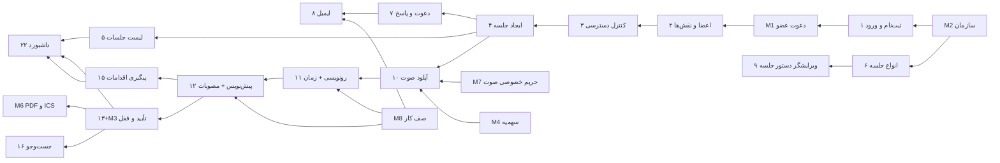
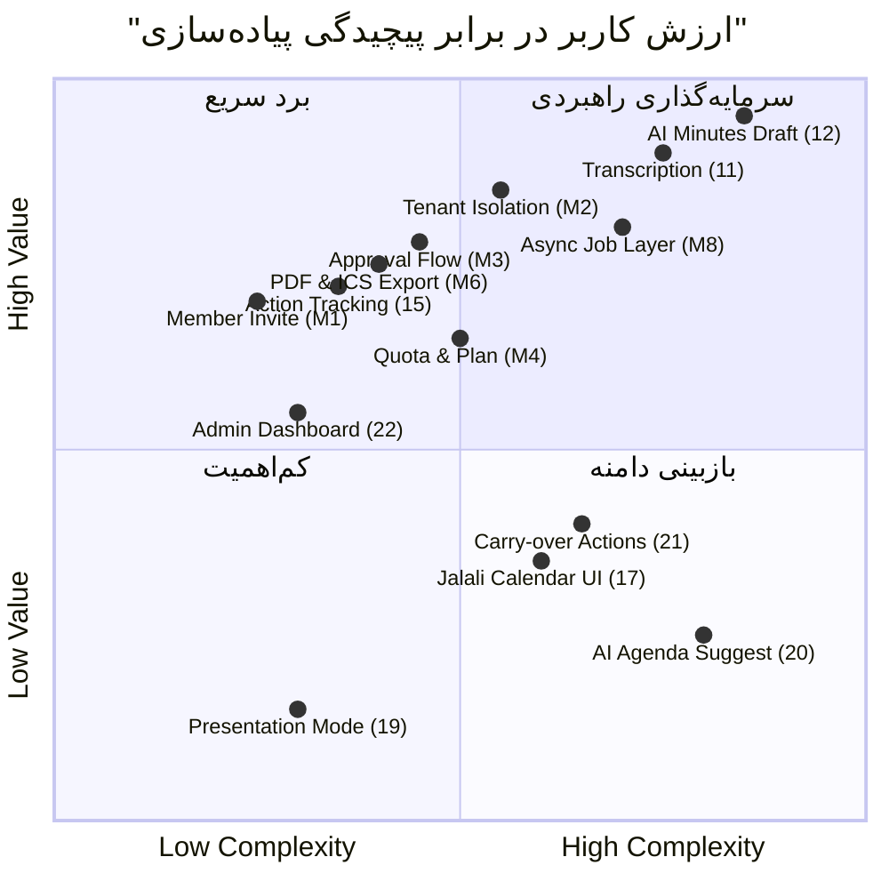

# سند بازبینی دامنهٔ فیچرهای MVP — سرویس SaaS مدیریت جلسات

- **نسخهٔ سند:** ۱.۰ | **تاریخ:** 2026-08-17 | **تهیه‌کننده:** ابراهیم خرم نژاد (مدیر محصول)
- **منبع ورودی:** `uploads/mvp_features.xlsx` — شیت «فیچرهای MVP» (۲۳ فیچر، ۷ ماژول) + شیت «خلاصه و راهنما»
- **دامنهٔ تأییدشده:** سطح **کامل (Full)**
- **قلمرو AI (تأییدشده):** تبدیل گفتار به متن فارسی، تولید پیش‌نویس صورتجلسه، استخراج خودکار مصوبات — همه از **API بیرونی** پشت لایهٔ Adapter مستقل
- **خارج از دامنه (تأییدشده):** تولید/پیشنهاد خودکار دستور جلسه با AI
- **الزام ظرفیتی:** **۱۰۰ کاربر همزمان** در فاز MVP
- **زبان/جهت:** فارسی، RTL

> در این فاز هیچ کدنویسی انجام نشده است؛ خروجی این سند فقط بازبینی محصولی و ورودی طراحی معماری است.

---

## ۱. خلاصهٔ مدیریتی

### ۱.۱ نتیجهٔ کلی

فهرست ۲۳فیچریِ ورودی از منظر **پوشش جریان اصلی ارزش** قوی است: زنجیرهٔ «ایجاد جلسه → دستور جلسه → دعوت → ضبط → رونویسی → پیش‌نویس صورتجلسه → تأیید → مصوبات → پیگیری اقدامات» کامل و بدون حلقهٔ گمشده است و همین زنجیره است که محصول را از یک «تقویم جلسات» متمایز می‌کند. این هسته باید محافظت شود و هیچ فیچر جانبی نباید پیش از آن اجرا شود.

با این حال فهرست از سه منظر کم‌پوشش است. **اول، لایهٔ SaaS بودن محصول:** فایل ورودی محصول را عملاً مانند یک نرم‌افزار تک‌شرکتی توصیف کرده است. سازمان/مستأجر به‌عنوان موجودیت درجه‌یک، جریان دعوت عضو با ایمیل و توکن، پلن و سهمیهٔ مصرف، Audit Log و صفحات حقوقی/رضایت هیچ ردیفی ندارند. شیت راهنما فقط «در نظر گرفتن `company_id`» را به‌عنوان یک تذکر معماری آورده است؛ تذکر بدون معیار پذیرش در عمل پیاده نمی‌شود.

**دوم، کنترل هزینه و ریسک AI:** بزرگ‌ترین هزینهٔ متغیر این محصول، دقایق رونویسی و توکن‌های تولید متن است. در فهرست هیچ فیچری برای سهمیه‌بندی، محدودسازی نرخ، مشاهدهٔ وضعیت و خطای کارهای AI، تلاش مجدد و مدیریت شکست وجود ندارد. با ۱۰۰ کاربر همزمان، این نقص می‌تواند بودجهٔ یک ماه AI را در یک روز مصرف کند.

**سوم، خروجی و حریم خصوصی داده:** صورتجلسه سندی نیمه‌رسمی است؛ نبودِ خروجی PDF و فایل ICS، محصول را در فروش سازمانی ضعیف می‌کند. فایل صوتی نیز حساس‌ترین دادهٔ سیستم است و عبارت کلی «دسترسی امن» در فیچر ۱۰ برای پاسخ به دپارتمان حقوقی مشتری کافی نیست.

### ۱.۲ جمع‌بندی تغییرات پیشنهادی

| نوع تغییر | تعداد | فیچرها |
|---|---|---|
| نگه‌داشتن بدون تغییر | ۱۱ | ۱، ۴، ۵، ۷، ۸، ۹، ۱۰، ۱۲، ۱۳، ۱۵، ۱۸ |
| نگه‌داشتن با کاهش/اصلاح دامنه | ۵ | ۲، ۳، ۶، ۱۶، ۲۲ |
| نگه‌داشتن با اولویت پایین‌تر | ۱ | ۱۷ |
| ادغام در فیچر دیگر | ۲ | ۱۴ ← در ۱۲ / ۲۳ ← در ۱۱ |
| انتقال به فاز بعد | ۲ | ۱۹، ۲۱ |
| حذف از دامنه | ۱ | ۲۰ |
| **فیچر جدید پیشنهادی** | **۱۴** | M1 … M14 |

### ۱.۳ سه توصیهٔ کلیدی

۱. **سازمان (Tenant) را از روز اول موجودیت درجه‌یک کنید، نه یک ستون.** فیچر M2 باید در اسپرینت ۱ باشد و معیار پذیرش قابل‌سنجش «نشت نکردن داده بین دو سازمان» با تست خودکار داشته باشد. تبدیل بعدی یک سیستم تک‌شرکتی به چندمستأجری، پرهزینه‌ترین بازنویسی ممکن است.

۲. **کارهای AI را به‌عنوان «صف کار قابل مشاهده» طراحی کنید، نه فراخوان تابع.** فیچرهای ۱۱، ۱۲ و ۱۴ باید روی زیرساخت Job مشترک (M8) بنشینند: وضعیت، تلاش مجدد، سقف همزمانی و ثبت مصرف. این تنها راه رسیدن به ۱۰۰ کاربر همزمان با هزینهٔ قابل پیش‌بینی است.

۳. **قبل از هر فیچر «بهتر است باشد»، بستهٔ قابل عرضه‌شدن را کامل کنید.** خروجی PDF (M6)، دعوت با ایمیل (M1)، سهمیه (M4) و سیاست فایل صوتی (M7) ارزش فروش بیشتری از تقویم گرافیکی و حالت ارائه دارند.

---

## ۲. بازبینی فیچرهای موجود

### ۲.۱ جدول ارزیابی فیچر به فیچر

| # | ماژول | نام فیچر | ارزیابی | دلیل و اصلاح پیشنهادی |
|---|---|---|---|---|
| ۱ | کاربران و دسترسی | ثبت‌نام و ورود | **نگه‌داشتن** | پایهٔ همه‌چیز. معیار پذیرش باید کمّی شود: سیاست رمز، سقف تلاش ورود، مدت انقضای نشست (بخش ۵.۲). |
| ۲ | کاربران و دسترسی | مدیریت اعضا و نقش‌ها | **نگه‌داشتن با اصلاح** | User Story «افزودن عضو» با معیار پذیرش «دعوت عضو» ناهمخوان است. تصمیم: فقط جریان دعوت با ایمیل (M1)؛ ساخت مستقیم کاربر با رمز توسط مدیر حذف شود (ریسک امنیتی و بار پشتیبانی). «حذف عضو» به **غیرفعال‌سازی نرم** تغییر کند تا صورتجلسه‌ها و اقدامات مالک خود را از دست ندهند. |
| ۳ | کاربران و دسترسی | کنترل دسترسی نقش‌محور | **نگه‌داشتن با کاهش دامنه** | ضروری، اما در MVP فقط سه نقش ثابت با مجوزهای از پیش تعریف‌شده کافی است؛ موتور نقش/مجوز قابل تنظیم مشتری به فاز بعد. الزام: اعمال در لایهٔ API، نه فقط UI. |
| ۴ | برنامه‌ریزی جلسه | ایجاد جلسه (ساده) | **نگه‌داشتن** | هستهٔ MVP. باید صریح شود: ذخیرهٔ زمان به UTC، نمایش شمسی در UI، منطقهٔ زمانی سازمان به‌عنوان مبنا. |
| ۵ | برنامه‌ریزی جلسه | لیست جلسات | **نگه‌داشتن** | جایگزین کم‌هزینهٔ تقویم و کافی برای MVP. افزودن صفحه‌بندی و ترتیب پیش‌فرض «نزدیک‌ترین جلسه» لازم است. |
| ۶ | برنامه‌ریزی جلسه | انواع جلسه و قالب دستور جلسه | **نگه‌داشتن با کاهش دامنه** | ارزش واقعی دارد، ولی قالب در MVP فقط فهرست سادهٔ «عنوان + مدت + مسئول» باشد، نه ویرایشگر قالب پیشرفته. سه نوع پیش‌ساخته (هیئت‌مدیره، عملیاتی، پروژه‌ای) به‌صورت دادهٔ اولیه تحویل شود. |
| ۷ | دعوت و حضور | دعوت اعضا و وضعیت پاسخ | **نگه‌داشتن** | لازم است. اما وضعیت «مشروط» تعریف‌نشده و User Story به «حد نصاب» اشاره دارد بدون فیچر متناظر → به M13 منتقل شد. |
| ۸ | دعوت و حضور | اطلاع‌رسانی ایمیلی | **نگه‌داشتن** | ایمیل تنها کانال اعلان MVP است. باید صف‌محور و غیرهمزمان باشد (نه در چرخهٔ درخواست HTTP) و مدیریت خطای ارسال/عدم تحویل داشته باشد. |
| ۹ | دستور جلسه | ویرایشگر دستور جلسه | **نگه‌داشتن** | ورودی کیفیِ لازم برای AI؛ دستور جلسهٔ ساختارمند، پیش‌نویس صورتجلسهٔ بهتری می‌سازد. پیوست باید سقف حجم و فهرست نوع مجاز داشته باشد. |
| ۱۰ | ضبط و رونویسی | آپلود فایل صوتی جلسه | **نگه‌داشتن** | هستهٔ ارزش. باید آپلود مستقیم به Storage با URL امضاشده باشد، نه عبور از سرور برنامه؛ در غیر این صورت با ۱۰۰ کاربر همزمان لایهٔ API اشباع می‌شود. سیاست حریم خصوصی و چرخهٔ عمر → M7. |
| ۱۱ | ضبط و رونویسی | تبدیل گفتار به متن فارسی | **نگه‌داشتن + جذب ۲۳** | تمایز اصلی محصول. مدل پیشنهادی از API بیرونی: **`scribe_v2`** (دقت بالا، ۹۰+ زبان از جمله فارسی). خروجی قطعه‌بندی‌شدهٔ زمانی همان ورودی فیچر ۲۳ است. |
| ۱۲ | صورتجلسه هوشمند | تولید خودکار پیش‌نویس صورتجلسه | **نگه‌داشتن + جذب ۱۴** | هستهٔ ارزش. مدل پیشنهادی: **`gpt-5.6-sol`** (نگارش ساختاریافته/چندزبانه) با خروجی JSON که هم متن صورتجلسه و هم فهرست مصوبات/اقدامات را در **یک فراخوان** برمی‌گرداند (کاهش هزینه و تأخیر). نیازمند راهبرد قطعه‌بندی برای متن‌های بلند. |
| ۱۳ | صورتجلسه هوشمند | ویرایش و تأیید نهایی | **نگه‌داشتن** | ضروری برای اعتبار سند. اما جریان وضعیت و مالکیت گذارها تعریف‌نشده است → M3. |
| ۱۴ | مصوبات و اقدامات | استخراج خودکار مصوبات و اقدامات | **ادغام در ۱۲** | دو دلیل: (۱) فنی — یک فراخوان AI روی همان متن است؛ (۲) محصولی — وابستگی فعلی به «تأیید نهایی» نادرست است؛ دبیر باید مصوبات پیشنهادی را **پیش از** تأیید ببیند و اصلاح کند، وگرنه پس از قفل سند امکان اصلاح از بین می‌رود. |
| ۱۵ | مصوبات و اقدامات | پیگیری وضعیت اقدامات | **نگه‌داشتن** | عامل بازگشت هفتگی کاربر به محصول (چسبندگی). توصیه: نمای «اقدامات من» به‌عنوان صفحهٔ خانهٔ نقش عضو. |
| ۱۶ | جست‌وجو و کنسول | جست‌وجوی ساده متنی | **نگه‌داشتن با اصلاح** | در MVP جست‌وجوی متنی پایگاه‌داده کافی است؛ موتور جداگانه و جست‌وجوی معنایی به فاز بعد. الزام حیاتی: **نرمال‌سازی فارسی** (ی/ي، ک/ك، نیم‌فاصله، اعراب) وگرنه نتایج عملاً بی‌فایده‌اند. |
| ۱۷ | برنامه‌ریزی جلسه | تقویم گرافیکی شمسی | **نگه‌داشتن با اولویت پایین‌تر** | جایگزین کارکردی موجود دارد (فیچر ۵ + فایل ICS در M6). توصیه: فقط **نمای ماه** در نسخهٔ اول؛ نمای هفته در صورت فشار زمانی به فاز بعد. |
| ۱۸ | برنامه‌ریزی جلسه | جلسات تکرارشونده | **نگه‌داشتن با محدودسازی** | برای جلسات هیئت‌مدیره/عملیاتی تقریباً الزامی است. محدودسازی: تولید حداکثر ۱۲ نمونهٔ آینده، فقط الگوهای روزانه/هفتگی/ماهانهٔ ساده، **بدون** قواعد پیچیده مانند «سه‌شنبهٔ آخر ماه». |
| ۱۹ | دستور جلسه | حالت ارائه | **انتقال به فاز بعد** | ارزش افزودهٔ کم در برابر جایگزین موجود (اشتراک صفحه یا PDF دستور جلسه). حذف آن هیچ جریان اصلی را نمی‌شکند. |
| ۲۰ | دستور جلسه | پیشنهاد دستور جلسه با AI | **حذف از دامنه** | مطابق تصمیم تأییدشده. تحلیل محصولی نیز تأیید می‌کند: مسئلهٔ Cold Start (در روز اول هیچ سابقه‌ای وجود ندارد)، هزینهٔ AI اضافه، و کیفیت پیشنهاد غیرقابل سنجش. بازبینی پس از انباشت چند ماه دادهٔ واقعی. |
| ۲۱ | مصوبات و اقدامات | ارجاع خودکار اقدامات معوق | **انتقال به فاز بعد** | ارزش مفهومی بالا، اما به دو پیش‌نیاز شکنندهٔ همزمان وابسته است (سری تکرارشونده + وضعیت اقدامات) و منطق «همان سری» را روی دادهٔ تثبیت‌نشده می‌سازد. جایگزین MVP: در ویرایشگر دستور جلسه بخش «اقدامات معوق مرتبط» فقط **نمایش** داده شود و دبیر با یک کلیک آن را اضافه کند (۱ روز-نفر در برابر ۴). |
| ۲۲ | جست‌وجو و کنسول | داشبورد مدیریتی | **نگه‌داشتن با کاهش دامنه** | ابزار فروش قوی برای نقش مدیر. در MVP فقط سه کارت عددی + دو فهرست (جلسات هفته، صورتجلسه‌های در انتظار تأیید، اقدامات معوق)، بدون نمودار و تحلیل روند. وابستگی آن به «جست‌وجو» نادرست است و باید حذف شود. |
| ۲۳ | ضبط و رونویسی | نشانه‌گذاری زمانی در رونویسی | **ادغام در ۱۱** | خروجی قطعه‌بندی‌شدهٔ زمانی، محصول جانبی طبیعی سرویس رونویسی است؛ کار واقعی فقط پخش‌کنندهٔ صوت همگام در UI است. به‌عنوان فیچر مستقل، تخمین و وابستگی را متورم می‌کند. |

### ۲.۲ الگوهای مشترک ضعف در فهرست ورودی

**الف) درهم‌آمیختگی «فیچر» با «جزئیات پیاده‌سازی».** فیچرهای ۲۳ و ۱۴ در واقع خروجی‌های جانبی فیچرهای بزرگ‌ترند، در حالی که مفاهیم بزرگی مانند «سازمان»، «جریان تأیید» و «سهمیه» هیچ ردیفی ندارند. اثر عملی این عدم‌تعادل در برنامه‌ریزی اسپرینت است: تیم ۲۳ آیتم می‌بیند و تصور می‌کند دامنه شناخته‌شده است، در حالی که چند مفهوم زیرساختی پرهزینه به‌صورت پنهان در دل ردیف‌های موجود جا خوش کرده و در تخمین دیده نمی‌شوند. نتیجهٔ محتمل، انحراف تخمین در محدودهٔ ۳۰ تا ۴۰ درصد است.

**ب) نبود معیار پذیرش کمّی.** تقریباً همهٔ ۲۳ معیار پذیرش از جنس «کار می‌کند / نمایش داده می‌شود» هستند. هیچ عددی برای زمان پاسخ، دقت رونویسی، سقف حجم فایل، مدت انقضای نشست یا زمان انتظار قابل قبول پردازش AI وجود ندارد. با الزام ۱۰۰ کاربر همزمان، این نقص مستقیماً به بحران تحویل تبدیل می‌شود، چون تعریف عینی «تمام شد» وجود ندارد.

**ج) وابستگی‌های بیش‌محافظه‌کارانه و زنجیرهٔ خطی.** فهرست ورودی زنجیرهٔ تقریباً کاملاً خطی ۱→۲→۳→۴→۶→۹→۱۰→۱۱→۱۲→۱۳→۱۴→۱۵→۱۶→۲۲ می‌سازد. این یک مسیر بحرانی مصنوعیِ بلند است و کار موازی تیم را غیرممکن می‌کند. بازبینی بخش ۵.۱ نشان می‌دهد حداقل پنج وابستگی قابل شکستن است.

**د) بی‌توجهی به مسیرهای شکست.** هیچ‌جا مشخص نشده اگر رونویسی شکست خورد، فایل صوتی خراب بود، سرویس AI بیرونی در دسترس نبود، سهمیهٔ سازمان تمام شد، یا متن رونویسی از پنجرهٔ مدل بلندتر بود چه اتفاقی می‌افتد. در محصولی که هستهٔ ارزشش بر یک API بیرونی سوار است، این‌ها موارد لبه نیستند؛ رخدادهای روزمره‌اند.

---

## ۳. فیچرهای مفقود (پیشنهاد افزودن)

### ۳.۱ فیچرهای لازم برای «SaaS چندمستأجری قابل عرضه»

| کد | فیچر | شرح | دلیل ضرورت | اولویت |
|---|---|---|---|---|
| **M1** | دعوت عضو با ایمیل و توکن | ورود ایمیل و نقش توسط مدیر؛ ایمیل دعوت با توکن یک‌بارمصرف و انقضادار؛ تعیین رمز توسط دعوت‌شده؛ لغو و ارسال مجدد دعوت. | فیچر ۲ به «دعوت» اشاره کرده اما جریان آن تعریف نشده است. بدون این، مدیر باید رمز کاربران را بسازد و منتقل کند؛ هم ریسک امنیتی و هم بار پشتیبانی. این دروازهٔ ورود همهٔ کاربران به محصول است. | Must |
| **M2** | سازمان (Tenant) به‌عنوان موجودیت درجه‌یک | ایجاد خودکار سازمان در ثبت‌نام اول، `organization_id` در همهٔ جداول اصلی، اعمال جداسازی داده در لایهٔ دسترسی، صفحهٔ تنظیمات سازمان (نام، لوگو، منطقهٔ زمانی). | شیت راهنما این را فقط «نکتهٔ معماری» دانسته؛ نکات معماری بدون معیار پذیرش پیاده نمی‌شوند. معیار پذیرش الزامی: تست خودکار «کاربر سازمان A هیچ رکوردی از سازمان B را نمی‌بیند». اولین نشت داده، محصول را از بازار سازمانی حذف می‌کند. | Must |
| **M3** | جریان وضعیت و تأیید صورتجلسه | وضعیت‌های صریح `draft → in_review → approved → locked`، مجوز هر گذار بر پایهٔ نقش، بازگردانی به پیش‌نویس فقط توسط مدیر با ثبت دلیل، نسخه‌بندی و نمایش تفاوت نسخه‌ها. | فیچر ۱۳ نتیجه (read-only شدن) را گفته اما جریان را نه. پرسش‌های عملی بی‌پاسخ‌اند: اگر مدیر رد کند؟ اگر پس از قفل غلط پیدا شود؟ چه کسی قفل را باز می‌کند؟ ابهام در این جریان، اعتماد مشتری سازمانی را از بین می‌برد. | Must |
| **M4** | پلن و سهمیهٔ مصرف | سقف در سطح سازمان: کاربر فعال، دقیقهٔ رونویسی ماهانه، حجم Storage، حجم تک‌آپلود. نمایش مصرف جاری، هشدار در ۸۰٪، بلوکه شدن نرم در ۱۰۰٪ با پیام واضح. | تنها سد دفاعی در برابر هزینهٔ کنترل‌نشدهٔ AI. با ۱۰۰ کاربر همزمان و بدون سهمیه، یک سازمان می‌تواند در یک روز صدها ساعت صوت آپلود کند و حاشیهٔ سود را منفی کند. پیش‌نیاز دادهٔ صورت‌حساب در فاز بعد نیز هست. | Must |
| **M5** | Audit Log | ثبت تغییرناپذیر رخدادهای حساس: ورود، تغییر نقش، دعوت/غیرفعال‌سازی عضو، تأیید/قفل/بازگشایی صورتجلسه، دانلود و حذف فایل صوتی؛ نمای فیلترشدنی برای مدیر. | در تقریباً هر ارزیابی امنیتی خرید سازمانی پرسیده می‌شود. افزودن پس از انتشار مستلزم بازگشت به همهٔ مسیرهای نوشتن است؛ ساخت اولیه به‌صورت لایهٔ مشترک هزینهٔ حداقلی دارد. برای صورتجلسه نقش «زنجیرهٔ اعتبار سند» را نیز ایفا می‌کند. | Must |
| **M6** | خروجی PDF صورتجلسه و فایل ICS جلسه | PDF فارسی/RTL از صورتجلسهٔ تأییدشده با لوگوی سازمان، فهرست حاضران و جدول مصوبات؛ پیوست PDF به ایمیل؛ فایل ICS ضمیمهٔ ایمیل دعوت. | صورتجلسه در سازمان ایرانی باید قابل چاپ، بایگانی و امضا باشد؛ بدون PDF کاربر خروجی را دستی به Word کپی می‌کند و ارزش محصول نصف می‌شود. ICS نیازِ واقعیِ پشت فیچر ۱۷ را با هزینهٔ بسیار کمتر برطرف می‌کند. | Must |
| **M7** | حریم خصوصی و چرخهٔ عمر فایل صوتی | رمزنگاری در حال سکون، دسترسی فقط با URL امضاشدهٔ کوتاه‌مدت، اعلام رضایت ضبط، سیاست نگه‌داری قابل تنظیم (حذف خودکار صوت پس از ۳۰/۹۰ روز از تأیید)، حذف دستی صوت با حفظ متن، ثبت هر دانلود در Audit Log. | فایل صوتی جلسهٔ هیئت‌مدیره حساس‌ترین دادهٔ سیستم است و «فقط اعضای مجاز دسترسی دارند» برای پاسخ به دپارتمان حقوقی مشتری کافی نیست. علاوه بر کاهش ریسک، حذف زمان‌بندی‌شده هزینهٔ Storage را نیز مستقیماً پایین می‌آورد. | Must |
| **M8** | زیرساخت کار غیرهمزمان با وضعیت و تلاش مجدد | صف کار مشترک برای رونویسی/تولید صورتجلسه/ایمیل؛ وضعیت قابل مشاهده (`queued/processing/failed/done`)؛ تلاش مجدد با عقب‌نشینی نمایی؛ پیام خطای قابل فهم و دکمهٔ «تلاش مجدد»؛ سقف همزمانی هر سازمان؛ ثبت مصرف هر کار. | فیچرهای ۱۱ و ۱۲ فقط گفته‌اند «Async انجام می‌شود» بدون تعریف مسیر شکست. با ۱۰۰ کاربر همزمان و وابستگی به API بیرونی، کندی و شکست حالت عادی است نه استثنا. بدون این فیچر، هر اختلال سرویس بیرونی به بحران پشتیبانی تبدیل می‌شود. | Must |

### ۳.۲ فیچرهای تکمیلی مؤثر بر تجربه، امنیت و فروش

| کد | فیچر | شرح | دلیل ضرورت | اولویت |
|---|---|---|---|---|
| **M9** | پروفایل کاربر و تنظیمات اعلان | ویرایش نام/تصویر، تغییر رمز، انتخاب منطقهٔ زمانی، خاموش/روشن کردن انواع ایمیل. | نبودِ تنظیمات اعلان مستقیماً به شکایت «ایمیل اضافی» و علامت‌گذاری دامنهٔ ما به‌عنوان اسپم می‌انجامد که سلامت ارسال ایمیل کل محصول را تهدید می‌کند. «تغییر رمز» نیز نیاز پایه‌ای غایب در فهرست ورودی است. | Should |
| **M10** | مرکز اعلان درون‌برنامه‌ای | فهرست اعلان با نشان خوانده/نخوانده برای: دعوت جلسه، تخصیص اقدام، آمادگی پیش‌نویس، درخواست تأیید. | ایمیل تنها کانال MVP است و نرخ باز شدن آن پایین. اعلان درون‌برنامه‌ای جریان «پیش‌نویس آماده شد → دبیر بازبینی می‌کند» را که قلب محصول است روان‌تر می‌کند و زیرساخت جدیدی لازم ندارد (همان رخدادهای M8). | Should |
| **M11** | محدودسازی نرخ و حفاظت از سوءاستفاده | سقف نرخ روی ورود و بازیابی رمز (IP + حساب)، سقف نرخ ایجاد کار AI به تفکیک سازمان، اعتبارسنجی نوع/اندازهٔ فایل پیش از پذیرش. | مکمل امنیتی M4؛ در برابر حملهٔ پرکردن اعتبارنامه و مصرف عمدی/سهوی سهمیه محافظت می‌کند و از فروپاشی سرویس در بار بالا جلوگیری می‌کند. هزینهٔ پیاده‌سازی کم و بازدهٔ ریسک بالا. | Should |
| **M12** | مشاهده‌پذیری و سلامت سرویس | لاگ ساختاریافته با شناسهٔ درخواست، متریک عمق صف/نرخ خطا/زمان پاسخ، `health check`، هشدار انباشت صف یا افزایش خطای AI، داشبورد عملیاتی داخلی. | الزام ۱۰۰ کاربر همزمان بدون ابزار سنجش، ادعایی غیرقابل اثبات است. پیش‌نیاز پذیرش رسمی الزامات غیرکارکردی (بخش ۶) و پیش‌نیاز آزمون بار. | Should |
| **M13** | حد نصاب و حضور و غیاب واقعی | تعریف حد نصاب برای هر نوع جلسه، محاسبهٔ خودکار وضعیت حد نصاب، و ثبت **حضور واقعی** در زمان جلسه برای درج در صورتجلسه. | User Story فیچر ۷ صریحاً «حد نصاب» را هدف گرفته اما هیچ فیچری آن را محقق نمی‌کند. صورتجلسهٔ معتبر به فهرست «حاضران» نیاز دارد نه «پذیرندگان دعوت»؛ این دو در جلسات واقعی همیشه متفاوت‌اند. | Should |
| **M14** | صفحات حقوقی و مالکیت داده | شرایط استفاده و سیاست حریم خصوصی، پذیرش صریح در ثبت‌نام، رضایت پردازش داده توسط AI بیرونی، خروجی کامل دادهٔ سازمان، درخواست حذف حساب. | ارسال محتوای جلسات محرمانه به API بیرونی بدون شفافیت و رضایت مکتوب، ریسک حقوقی و اعتباری بالایی دارد. این کوچک‌ترین بستهٔ لازم برای «قابل عرضه بودن» یک SaaS است، نه یک فیچر لوکس. | Should |

### ۳.۳ موارد آگاهانه خارج از دامنهٔ نسخهٔ اول

| مورد | دلیل خارج ماندن | جایگزین در MVP |
|---|---|---|
| پیشنهاد دستور جلسه با AI (فیچر ۲۰) | تصمیم تأییدشده؛ Cold Start و کیفیت غیرقابل سنجش | قالب دستور جلسه بر پایهٔ نوع جلسه (فیچر ۶) |
| صورت‌حساب و پرداخت آنلاین | فروش اولیه قراردادی است؛ ساخت پرداخت پیش از تثبیت پلن‌ها دوباره‌کاری است | پلن و سهمیه (M4) بدون درگاه پرداخت |
| ادغام دوطرفه با Google/Outlook Calendar | پیچیدگی OAuth و همگام‌سازی دوطرفه چند برابر ارزش MVP | فایل ICS در ایمیل دعوت (M6) |
| ادغام با Zoom/Teams/Meet | نیازمند تأیید اپلیکیشن در هر پلتفرم و نگه‌داری مستمر | فیلد متنی «لینک جلسهٔ آنلاین» (فیچر ۴) |
| شرکت‌کنندهٔ مهمان خارج از سازمان | مدل دسترسی و سهمیه را پیچیده می‌کند | ارسال دستی PDF صورتجلسه به ایمیل خارجی |
| رونویسی زندهٔ همزمان با جلسه | هزینهٔ زیرساخت جریانی و ریسک کیفیت بالا | آپلود فایل پس از جلسه (فیچر ۱۰) |
| تفکیک گویندگان (Diarization) | افزایش هزینه و پیچیدگی؛ ارزش آن باید با رفتار واقعی کاربر سنجیده شود | نشانهٔ زمانی + ویرایش دستی متن |
| اپلیکیشن موبایل بومی | وب واکنش‌گرا برای جریان‌های MVP کافی است | وب واکنش‌گرا با تجربهٔ موبایل قابل قبول |
| امضای دیجیتال صورتجلسه | نیازمند زیرساخت گواهی و الزامات حقوقی خاص | PDF قفل‌شده + Audit Log (M5, M6) |

---

## ۴. اولویت‌بندی MoSCoW و تخمین نسبی

### ۴.۱ روش

تخمین‌ها به **روز-نفر (Person-Day)** و نسبی هستند؛ مبنای مقایسه، «ایجاد جلسهٔ ساده» به‌عنوان واحد میانی (۳ روز-نفر) در نظر گرفته شده است. هر عدد شامل کار سمت سرور، سمت کاربر، تست و بازبینی است، اما شامل زمان طراحی گرافیکی و آزمون بار نیست (به‌صورت جداگانه در بخش ۶.۴ آمده است).

### ۴.۲ Must have — بستهٔ حداقلیِ قابل عرضه

بدون هر یک از این آیتم‌ها، محصول یا جریان اصلی خود را از دست می‌دهد یا از نظر امنیت/هزینه/حقوقی قابل عرضه نیست.

| کد | فیچر | تخمین (روز-نفر) | توضیح تخمین |
|---|---|---|---|
| M2 | سازمان به‌عنوان موجودیت درجه‌یک | ۴ | مدل داده + اعمال جداسازی در لایهٔ دسترسی + تست نشت داده |
| ۱ | ثبت‌نام و ورود | ۴ | تأیید ایمیل، بازیابی رمز، مدیریت نشست |
| M1 | دعوت عضو با ایمیل و توکن | ۳ | توکن انقضادار، پذیرش دعوت، لغو/ارسال مجدد |
| ۲ | مدیریت اعضا و نقش‌ها (اصلاح‌شده) | ۳ | فهرست اعضا، تغییر نقش، غیرفعال‌سازی نرم |
| ۳ | کنترل دسترسی نقش‌محور | ۳ | سه نقش ثابت، اعمال در لایهٔ API |
| ۴ | ایجاد جلسه (ساده) | ۳ | فرم + تقویم شمسی + ذخیرهٔ UTC |
| ۵ | لیست جلسات | ۲ | فیلتر، صفحه‌بندی، تفکیک آینده/گذشته |
| ۶ | انواع جلسه و قالب دستور جلسه (کاهش‌یافته) | ۳ | سه نوع پیش‌ساخته + قالب فهرست ساده |
| ۹ | ویرایشگر دستور جلسه | ۵ | آیتم‌ها، ترتیب‌دهی، مسئول/زمان، پیوست |
| ۷ | دعوت اعضا و وضعیت پاسخ | ۳ | دعوت، ثبت پاسخ، نمای وضعیت |
| ۸ | اطلاع‌رسانی ایمیلی | ۴ | سه قالب ایمیل + زمان‌بند یادآوری + مدیریت خطا |
| M8 | زیرساخت کار غیرهمزمان | ۶ | صف، وضعیت، تلاش مجدد، سقف همزمانی، ثبت مصرف |
| ۱۰ | آپلود فایل صوتی | ۴ | آپلود مستقیم با URL امضاشده + اعتبارسنجی |
| ۱۱ | تبدیل گفتار به متن فارسی (+ نشانهٔ زمانی) | ۷ | Adapter رونویسی `scribe_v2` + نمایش همگام متن و صوت |
| ۱۲ | پیش‌نویس صورتجلسه (+ استخراج مصوبات) | ۸ | Adapter `gpt-5.6-sol`، قطعه‌بندی متن بلند، خروجی JSON ساختاریافته |
| ۱۳ + M3 | ویرایش، جریان تأیید و قفل صورتجلسه | ۷ | ویرایشگر + ماشین وضعیت + نسخه‌بندی و تاریخچه |
| ۱۵ | پیگیری وضعیت اقدامات | ۴ | فهرست اقدامات، تغییر وضعیت، نمای «اقدامات من» |
| M6 | خروجی PDF صورتجلسه + فایل ICS | ۵ | قالب PDF فارسی/RTL، فونت، پیوست ایمیل، تولید ICS |
| M7 | حریم خصوصی و چرخهٔ عمر فایل صوتی | ۴ | رمزنگاری، URL امضاشده، سیاست نگه‌داری، حذف زمان‌بندی‌شده |
| M4 | پلن و سهمیهٔ مصرف | ۵ | شمارنده‌های مصرف، هشدار ۸۰٪، بلوکه شدن نرم |
| M5 | Audit Log | ۳ | لایهٔ مشترک ثبت رخداد + نمای مدیر |
| **جمع Must** | | **≈ ۹۰** | |

### ۴.۳ Should have — ارزش بالا، اما بدون آن‌ها هم قابل عرضه است

| کد | فیچر | تخمین (روز-نفر) | توضیح |
|---|---|---|---|
| ۱۶ | جست‌وجوی متنی با نرمال‌سازی فارسی | ۴ | ایندکس متنی + لایهٔ نرمال‌سازی |
| ۲۲ | داشبورد مدیریتی (کاهش‌یافته) | ۳ | سه کارت عددی + دو فهرست |
| M12 | مشاهده‌پذیری و سلامت سرویس | ۴ | لاگ ساختاریافته، متریک، هشدار |
| M11 | محدودسازی نرخ و حفاظت از سوءاستفاده | ۲ | سقف نرخ ورود و ایجاد کار AI |
| M14 | صفحات حقوقی و مالکیت داده | ۳ | متون، پذیرش در ثبت‌نام، خروجی/حذف داده |
| M9 | پروفایل کاربر و تنظیمات اعلان | ۳ | پروفایل، تغییر رمز، تنظیمات ایمیل |
| ۱۸ | جلسات تکرارشونده (محدودشده) | ۴ | الگوهای ساده، حداکثر ۱۲ نمونه |
| M13 | حد نصاب و حضور و غیاب واقعی | ۴ | حد نصاب هر نوع جلسه + ثبت حاضران |
| M10 | مرکز اعلان درون‌برنامه‌ای | ۳ | فهرست اعلان + نشان نخوانده |
| **جمع Should** | | **≈ ۳۰** | |

### ۴.۴ Could have — در صورت وجود ظرفیت زمانی

| کد | فیچر | تخمین (روز-نفر) | توضیح |
|---|---|---|---|
| ۱۷ | تقویم گرافیکی شمسی (فقط نمای ماه) | ۵ | نمای هفته حذف؛ ارزش آن با M6/ICS تا حد زیادی پوشش داده شده |
| — | نمای «اقدامات معوق مرتبط» در دستور جلسه (جایگزین سبک فیچر ۲۱) | ۱ | فقط نمایش و افزودن دستی با یک کلیک |
| — | خروجی Excel/CSV از اقدامات | ۲ | نیاز رایج مدیران برای گزارش‌گیری |
| **جمع Could** | | **≈ ۸** | |

### ۴.۵ Won't have (این نسخه)

| کد | مورد | جایگزین |
|---|---|---|
| ۲۰ | پیشنهاد دستور جلسه با AI | قالب نوع جلسه (فیچر ۶) |
| ۱۹ | حالت ارائه | اشتراک صفحه / PDF دستور جلسه |
| ۲۱ | ارجاع خودکار اقدامات معوق | نمای دستیِ «اقدامات معوق مرتبط» |
| — | صورت‌حساب و پرداخت، ادغام تقویم/Zoom، مهمان خارجی، رونویسی زنده، تفکیک گویندگان، اپ موبایل بومی، امضای دیجیتال | بخش ۳.۳ |

### ۴.۶ جمع‌بندی حجم کار و توالی پیشنهادی

جمع کل: **Must ≈ ۹۰**، **Should ≈ ۳۰**، **Could ≈ ۸** روز-نفر (بدون آزمون بار و طراحی گرافیکی). با تیم ۳ نفرهٔ مهندسی و بهره‌وری واقع‌بینانه، بستهٔ Must در حدود **۷ تا ۸ هفته** و بستهٔ Must + Should در حدود **۱۰ تا ۱۲ هفته** قابل تحویل است. توالی پیشنهادی در چهار برش:

- **برش ۱ (پایه و SaaS):** M2، ۱، M1، ۲، ۳، M5 — انتهای برش: چند سازمان مستقل با کاربران و نقش‌های واقعی و لاگ رخداد.
- **برش ۲ (چرخهٔ جلسه):** ۴، ۵، ۶، ۹، ۷، ۸، M6/ICS — انتهای برش: محصول بدون AI هم قابل استفاده است (ریسک‌گیری هوشمندانه).
- **برش ۳ (هستهٔ AI):** M8، ۱۰، M7، ۱۱، ۱۲، ۱۳+M3، M4 — انتهای برش: تمایز اصلی محصول به‌همراه کنترل هزینه.
- **برش ۴ (تکمیل و عرضه):** ۱۵، M6/PDF، ۱۶، ۲۲، M12، M11، M14 — انتهای برش: آمادهٔ عرضه با مشاهده‌پذیری و پوشش حقوقی.

نکتهٔ مهم برنامه‌ریزی: **M8 (زیرساخت کار غیرهمزمان) باید پیش از ۱۱ و ۱۲ تمام شود.** اگر رونویسی مستقیماً و بدون صف پیاده شود، بازنویسی آن در برش ۴ حداقل ۵ روز-نفر هزینهٔ اضافه دارد.

---

## ۵. بازبینی وابستگی‌ها و معیارهای پذیرش ناقص

### ۵.۱ اصلاح وابستگی‌ها

فهرست ورودی یک زنجیرهٔ خطی طولانی می‌سازد که مسیر بحرانی را به‌صورت مصنوعی بلند می‌کند. اصلاحات زیر پیشنهاد می‌شود:

| فیچر | وابستگی در فایل ورودی | وابستگی اصلاح‌شده | دلیل |
|---|---|---|---|
| ۱۲ پیش‌نویس صورتجلسه | ۱۱ + ۹ | **۱۱** (۹ اختیاری) | دستور جلسه کیفیت خروجی را بهتر می‌کند اما پیش‌نیاز فنی نیست؛ بدون آن هم می‌توان از رونویسی پیش‌نویس ساخت. حذف این وابستگی، توسعهٔ موازی دو ماژول را آزاد می‌کند. |
| ۱۴ استخراج مصوبات | ۱۳ (تأیید نهایی) | **۱۲** | وابستگی فعلی از نظر محصولی غلط است؛ مصوبات باید پیش از تأیید قابل اصلاح باشند. این تغییر یک نقص کاربردی جدی را رفع می‌کند، نه فقط ترتیب کار را. |
| ۱۵ پیگیری اقدامات | ۱۴ | **۱۲ (خروجی مصوبات)** | با ادغام ۱۴ در ۱۲، وابستگی مستقیم می‌شود؛ ضمناً امکان ثبت دستی اقدام باید مستقل از AI کار کند تا در صورت خرابی سرویس بیرونی، ماژول اقدامات از کار نیفتد. |
| ۲۲ داشبورد مدیریتی | ۱۶ (جست‌وجو) | **۵ + ۱۳ + ۱۵** | داشبورد به شمارش و تجمیع نیاز دارد، نه به جست‌وجو. این وابستگی نادرست، داشبورد را بی‌دلیل به انتهای زنجیره رانده است. |
| ۶ انواع جلسه | ۴ | **M2 (سازمان)** | انواع جلسه دادهٔ سطح سازمان است و منطقاً پیش از ایجاد جلسه ساخته می‌شود؛ وابستگی فعلی ترتیب را معکوس نشان می‌دهد. |
| ۱۱ رونویسی، ۱۲ پیش‌نویس، ۸ ایمیل | — | **M8 (صف کار)** | وابستگی حیاتیِ غایب در فایل ورودی؛ نادیده گرفتن آن منجر به بازنویسی می‌شود. |
| همهٔ فیچرهای داده‌محور | — | **M2 (سازمان)** | جداسازی مستأجر باید پیش از ساخت هر جدول اصلی وجود داشته باشد. |
| ۱۰ آپلود صوت | ۴ | **۴ + M7 + M4** | سیاست حریم خصوصی و سقف سهمیه باید همزمان با آپلود اعمال شوند، نه بعد از آن. |

نمودار وابستگی اصلاح‌شده (سطوح، از پایه به بالا):

### ۵.۲ معیارهای پذیرش ناقص و نسخهٔ اصلاح‌شده

| # | نقص معیار پذیرش فعلی | معیار پذیرش پیشنهادی (کمّی و قابل آزمون) |
|---|---|---|
| ۱ | «نشست پس از عدم فعالیت منقضی می‌شود» — بدون عدد | حداقل ۱۰ کاراکتر رمز با ترکیب حرف و عدد؛ انقضای نشست پس از ۳۰ دقیقه عدم فعالیت یا ۱۲ ساعت مطلق؛ پس از ۵ تلاش ناموفق در ۱۵ دقیقه، حساب ۱۵ دقیقه قفل می‌شود؛ لینک بازیابی رمز فقط ۳۰ دقیقه و یک‌بار معتبر است. |
| ۲ | «حذف عضو دسترسی او را فوراً قطع می‌کند» — سرنوشت داده نامعلوم | غیرفعال‌سازی عضو حداکثر تا ۶۰ ثانیه همهٔ نشست‌های فعال او را باطل می‌کند؛ صورتجلسه‌ها و اقدامات او حفظ می‌شوند و نام او با نشان «غیرفعال» نمایش داده می‌شود؛ اقدامات باز او در فهرست «بدون مسئول» ظاهر می‌شوند. |
| ۴ | «فیلد تاریخ نامعتبر رد می‌شود» | تاریخ در UI شمسی و در پایگاه داده UTC؛ تبدیل شمسی↔میلادی برای ۱۰۰ تاریخ نمونه (شامل سال کبیسه و ۳۰ اسفند) بدون خطا؛ ایجاد جلسه در گذشته با پیام صریح رد می‌شود؛ مدت جلسه بین ۵ و ۴۸۰ دقیقه. |
| ۸ | «ایمیل بلافاصله ارسال می‌شود» — تعریف «بلافاصله» نامعلوم | ۹۵٪ ایمیل‌ها حداکثر ۶۰ ثانیه پس از رخداد در صف قرار می‌گیرند؛ یادآوری ۲۴ ساعت و ۱ ساعت پیش از جلسه ارسال می‌شود؛ در صورت شکست، ۳ تلاش مجدد با فاصلهٔ نمایی؛ شکست نهایی برای مدیر قابل مشاهده است. |
| ۱۰ | «آپلود تا حجم مشخص‌شده» — حجم مشخص نشده | سقف ۵۰۰ مگابایت و ۳ ساعت برای هر فایل؛ فرمت‌های مجاز `mp3, m4a, wav, mp4`؛ آپلود ۲۰۰ مگابایتی با اتصال ۱۰Mbps موفق و قابل ازسرگیری؛ فایل با فرمت/حجم نامجاز **پیش از** انتقال بایت‌ها رد می‌شود؛ URL دانلود حداکثر ۱۵ دقیقه معتبر است. |
| ۱۱ | «رونویسی Async انجام و وضعیت نمایش داده می‌شود» — بدون کیفیت و زمان | نرخ خطای واژه برای صوت فارسی تک‌گوینده با کیفیت مناسب حداکثر ۲۵٪؛ زمان پردازش حداکثر ۰٫۵ برابر مدت صوت در بار عادی؛ وضعیت با حداکثر ۱۰ ثانیه تأخیر به‌روزرسانی می‌شود؛ در شکست، پیام فارسی قابل فهم + دکمهٔ تلاش مجدد؛ حداکثر ۳ تلاش خودکار. |
| ۱۲ | «پیش‌نویس خودکار ساخته و نمایش داده می‌شود» | پیش‌نویس شامل: خلاصهٔ کلی، شرح به تفکیک آیتم دستور جلسه، فهرست مصوبات و فهرست اقدامات با مسئول و مهلت پیشنهادی؛ برای رونویسی تا ۲۰٬۰۰۰ کلمه بدون خطا (با قطعه‌بندی)؛ زمان تولید حداکثر ۳ دقیقه؛ هر مصوبه/اقدام پیش از تأیید قابل ویرایش یا حذف است؛ در صورت عدم شناسایی مسئول، فیلد خالی و علامت‌گذاری‌شده می‌ماند (نه حدس اشتباه). |
| ۱۳ | «تاریخچه تغییرات ثبت می‌شود» — دامنه نامعلوم | هر ذخیره یک نسخه با کاربر و زمان می‌سازد؛ امکان مشاهدهٔ تفاوت دو نسخه؛ پس از تأیید، هر تلاش نوشتن خطای ۴۰۹/۴۰۳ برمی‌گرداند؛ بازگشایی قفل فقط توسط مدیر با ثبت دلیل و ثبت در Audit Log؛ آزمون امنیتی: دبیر نمی‌تواند سند تأییدشده را با فراخوانی مستقیم API تغییر دهد. |
| ۱۴ | «لیست مصوبات خودکار ساخته می‌شود» | هر اقدام دارای عنوان، مسئول (کاربر سازمان)، مهلت و وضعیت اولیه `open` است؛ اقدام بدون مسئول قابل ذخیره است اما در داشبورد به‌عنوان «نیازمند تعیین مسئول» نشان داده می‌شود. |
| ۱۶ | «نتیجه صحیح برمی‌گرداند» — بدون معیار عینی | جست‌وجوی «تصميم» و «تصمیم» و «تصمیم‌گیری» نتایج یکسان و مرتبط برمی‌گردانند (نرمال‌سازی ی/ک/نیم‌فاصله/اعراب)؛ زمان پاسخ برای ۱۰٬۰۰۰ صورتجلسه در سازمان حداکثر ۱ ثانیه (p95)؛ نتایج فقط از سازمان کاربر و فقط از اسنادی که کاربر مجاز به دیدن آن‌ها است. |
| ۱۷ | «فیلتر نوع/نقش کار می‌کند» | نمای ماه با ۲۰۰ جلسه در ماه حداکثر در ۱٫۵ ثانیه بارگذاری می‌شود؛ روزهای تعطیل رسمی شمسی متمایز نمایش داده می‌شوند؛ ناوبری ماه بعد/قبل بدون بارگذاری کامل صفحه. |
| ۱۸ | «نمونه‌های آینده خودکار ساخته می‌شود» — بی‌سقف | حداکثر ۱۲ نمونهٔ آینده تولید می‌شود و با گذشت زمان تمدید می‌شود؛ ویرایش یک نمونه بر سایر نمونه‌ها اثر نمی‌گذارد؛ حذف سری، فقط نمونه‌های آیندهٔ **بدون** صورتجلسه را حذف می‌کند. |
| ۲۲ | «آمار نمایش داده می‌شود» | داشبورد حداکثر در ۲ ثانیه (p95) بارگذاری می‌شود؛ اعداد با فهرست‌های متناظر مطابقت دقیق دارند؛ هر کارت به فهرست فیلترشدهٔ مربوطه لینک می‌شود. |
| ۲۳ | «کلیک روی خط، پخش را به همان لحظه می‌برد» | دقت پرش حداکثر ۱ ثانیه خطا؛ خط در حال پخش به‌صورت خودکار برجسته و اسکرول می‌شود؛ عملکرد در صوت ۳ ساعته بدون افت محسوس. |

### ۵.۳ ابهام‌های باقی‌مانده که نیازمند تصمیم است

| # | پرسش | اثر بر دامنه | پیشنهاد پیش‌فرض |
|---|---|---|---|
| Q1 | معنای دقیق پاسخ «مشروط» در دعوت چیست و در محاسبهٔ حد نصاب چگونه شمرده می‌شود؟ | متوسط (M13) | «مشروط» = حضور احتمالی؛ در حد نصاب **شمرده نمی‌شود** و فیلد یادداشت اختیاری دارد. |
| Q2 | آیا مدیر می‌تواند نقش «دبیر» را به چند نفر در یک جلسه بدهد؟ | کم (۳، ۷) | هر جلسه یک دبیر مسئول دارد؛ مدیر همیشه اختیارات دبیر را نیز دارد. |
| Q3 | سیاست پیش‌فرض نگه‌داری فایل صوتی چند روز باشد؟ | متوسط (M7، هزینهٔ Storage) | پیش‌فرض ۹۰ روز پس از تأیید صورتجلسه، قابل تغییر توسط مدیر بین ۳۰ و ۳۶۵ روز. |
| Q4 | سقف پلن پیش‌فرض MVP چقدر است (کاربر / دقیقهٔ رونویسی)؟ | بالا (M4، مدل هزینه) | ۲۵ کاربر فعال و ۱٬۲۰۰ دقیقه رونویسی در ماه برای هر سازمان. |
| Q5 | آیا فایل صوتی/متن جلسه می‌تواند برای بهبود مدل به سرویس بیرونی داده شود؟ | بالا (M14، حقوقی) | خیر؛ قرارداد با تأمین‌کننده باید «عدم استفاده برای آموزش» را تضمین کند و این در سیاست حریم خصوصی صریح شود. |
| Q6 | زبان ورودی جلسات فقط فارسی است یا فارسی/انگلیسی مخلوط؟ | متوسط (۱۱، کیفیت) | پشتیبانی از فارسی با تحمل واژه‌های انگلیسی؛ جلسهٔ کاملاً انگلیسی پشتیبانی می‌شود اما کیفیت آن تضمین‌شده نیست. |
| Q7 | آیا اقدامات باید به عضو غیرفعال‌شده قابل تخصیص بمانند؟ | کم (۱۵، ۲) | خیر؛ در غیرفعال‌سازی، اقدامات باز به فهرست «بدون مسئول» منتقل و به مدیر اعلان داده می‌شود. |
| Q8 | حداکثر مدت انتظار قابل قبول کاربر برای آماده شدن پیش‌نویس چقدر است؟ | بالا (M8، ظرفیت) | برای صوت یک‌ساعته، حداکثر ۲۰ دقیقه از پایان آپلود تا آمادگی پیش‌نویس در بار عادی. |

---

## ۶. الزامات غیرکارکردی برای ۱۰۰ کاربر همزمان

### ۶.۱ تفسیر عددی «۱۰۰ کاربر همزمان»

«۱۰۰ کاربر همزمان» به‌تنهایی یک الزام قابل آزمون نیست؛ باید به بار قابل اندازه‌گیری ترجمه شود. تفسیر پیشنهادی برای فاز MVP:

| شاخص | مقدار هدف MVP | توضیح |
|---|---|---|
| کاربران فعال همزمان (نشست باز) | ۱۰۰ | در بازهٔ اوج، معمولاً ابتدای ساعات کاری |
| نرخ درخواست خواندن | ۲۰–۳۰ درخواست بر ثانیه | فهرست جلسات، داشبورد، مشاهدهٔ صورتجلسه |
| نرخ درخواست نوشتن | ۲–۵ درخواست بر ثانیه | ایجاد جلسه، ویرایش دستور جلسه، به‌روزرسانی اقدام |
| آپلود همزمان فایل صوتی | حداکثر ۵ | تحمل تا ۱۰ با افزایش زمان انتظار |
| کارهای AI فعال همزمان | حداکثر ۱۰ در کل سیستم، حداکثر ۳ در هر سازمان | مازاد در صف با نمایش نوبت |
| کارهای AI روزانه | حداکثر ۲۰۰ کار | مبنای برآورد هزینهٔ متغیر ماهانه |
| ایمیل خروجی در اوج | ۵۰۰ ایمیل در ساعت | ارسال دسته‌ای دعوت و یادآوری |

نکتهٔ کلیدی طراحی: بار خواندنِ ۱۰۰ کاربر همزمان بار سنگینی **نیست** و با یک نمونهٔ برنامه به‌راحتی پاسخ داده می‌شود؛ خطر واقعی در سه نقطه است: (۱) آپلودهای حجیم که از سرور برنامه عبور کنند، (۲) کارهای AI که به‌صورت همزمان و بی‌سقف اجرا شوند، (۳) ارسال ایمیل درون چرخهٔ درخواست. هر سهٔ این‌ها با انتقال به مسیر غیرهمزمان و Storage مستقیم حل می‌شوند.

### ۶.۲ اهداف عملکرد و دسترس‌پذیری

| شاخص | هدف MVP | روش سنجش |
|---|---|---|
| زمان پاسخ API خواندن (p95) | < ۵۰۰ میلی‌ثانیه | آزمون بار با ۱۰۰ کاربر مجازی |
| زمان پاسخ API نوشتن (p95) | < ۱ ثانیه | آزمون بار |
| بارگذاری اولیهٔ صفحه (p95) | < ۲٫۵ ثانیه | اندازه‌گیری در شبکهٔ ۴G شبیه‌سازی‌شده |
| بارگذاری داشبورد (p95) | < ۲ ثانیه | آزمون با دادهٔ سازمان بزرگ نمونه |
| نرخ خطای HTTP 5xx | < ۰٫۵٪ | متریک زمان اجرا (M12) |
| دسترس‌پذیری ماهانه | ≥ ۹۹٪ | خارج از پنجرهٔ نگه‌داری اعلام‌شده |
| زمان انتظار در صف AI (p95) | < ۵ دقیقه | متریک عمق صف |
| موفقیت کار AI (پس از تلاش مجدد) | ≥ ۹۷٪ | نسبت `done` به کل کارها |
| نرخ تحویل ایمیل | ≥ ۹۵٪ | گزارش تأمین‌کنندهٔ ایمیل |

### ۶.۳ الزامات معماری‌ساز (ورودی برای سند معماری)

**الف) جداسازی مسیر همزمان و غیرهمزمان.** هیچ عملیات وابسته به سرویس بیرونی (رونویسی، تولید متن، ارسال ایمیل، تولید PDF) نباید در چرخهٔ درخواست HTTP اجرا شود. همه باید از طریق M8 به صف بروند و کاربر شناسهٔ کار و وضعیت را دریافت کند. این تنها راه است که کندی سرویس بیرونی، پاسخ‌دهی کل برنامه را قربانی نکند.

**ب) آپلود مستقیم به Storage.** فایل صوتی باید با URL امضاشده مستقیماً به Storage آپلود شود. اگر فایل ۳۰۰ مگابایتی از سرور برنامه عبور کند، پنج آپلود همزمان می‌تواند پهنای باند و حافظهٔ نمونهٔ برنامه را اشباع کند و همهٔ ۱۰۰ کاربر را تحت تأثیر قرار دهد.

**ج) لایهٔ Adapter مستقل برای AI.** مطابق نکتهٔ شیت راهنما، سرویس‌های رونویسی و تولید متن باید پشت یک واسط مستقل با قراردادهای داخلی قرار گیرند (`transcribe(audio) -> segments`، `draftMinutes(context) -> structured`). این کار سه فایده دارد: امکان جایگزینی تأمین‌کننده یا نسخهٔ آنپرمیس آینده، امکان mock کردن در تست بدون هزینه، و امکان اعمال متمرکز سیاست‌های تلاش مجدد و سقف هزینه.

**د) سقف همزمانی و انصاف بین مستأجرها.** سقف کارهای AI باید هم در سطح کل سیستم و هم در سطح هر سازمان اعمال شود؛ در غیر این صورت یک سازمان با آپلود دسته‌ای، صف را اشغال و کاربران سایر سازمان‌ها را عملاً از سرویس محروم می‌کند.

**ه) ایندکس‌گذاری و الگوی پرس‌وجو.** همهٔ پرس‌وجوهای اصلی باید با پیشوند `organization_id` ایندکس شوند؛ ایندکس‌های ترکیبی برای «جلسات سازمان بر اساس زمان»، «اقدامات مسئول بر اساس وضعیت» و ایندکس متنی نرمال‌شدهٔ فارسی برای جست‌وجو الزامی است. داشبورد باید از پرس‌وجوهای تجمیعی سبک استفاده کند، نه از پیمایش کامل جداول.

**و) کش و بار خواندن.** دادهٔ کم‌تغییر (انواع جلسه، اعضای سازمان، سهمیهٔ جاری) باید کش کوتاه‌مدت داشته باشد؛ این ساده‌ترین راه کاهش بار خواندن در ساعات اوج است.

**ز) بی‌اثری تکرار (Idempotency) و قابلیت ازسرگیری.** ایجاد کار AI باید idempotent باشد تا کلیک مکرر کاربر یا تلاش مجدد شبکه، هزینهٔ چندبرابر تولید نکند. آپلود باید قابل ازسرگیری باشد تا قطع اتصال در فایل بزرگ، کار را از صفر آغاز نکند.

### ۶.۴ الزامات امنیت، حریم خصوصی و پایداری

**امنیت:** رمزنگاری در حال انتقال (TLS) و در حال سکون؛ هش رمز با الگوریتم مدرن؛ اعمال مجوز در لایهٔ API برای همهٔ منابع؛ آزمون خودکار «دسترسی بین‌سازمانی» در هر انتشار؛ محدودسازی نرخ (M11)؛ عدم درج دادهٔ حساس در لاگ‌ها؛ چرخش و نگه‌داری امن کلیدهای API سرویس بیرونی در سمت سرور (هرگز در سمت کاربر).

**حریم خصوصی:** حداقل‌سازی داده در ارسال به AI بیرونی (فقط متن لازم، بدون داده‌های شناسایی‌کنندهٔ غیرضروری)؛ سیاست نگه‌داری و حذف (M7)؛ شفافیت و رضایت (M14)؛ ثبت هر دسترسی به فایل صوتی در Audit Log (M5).

**پایداری و بازیابی:** پشتیبان‌گیری روزانهٔ پایگاه داده با نگه‌داری ۷ روزه و آزمون بازیابی حداقل یک‌بار پیش از عرضه؛ RPO ≤ ۲۴ ساعت و RTO ≤ ۴ ساعت برای MVP؛ صف کار باید پایدار (persistent) باشد تا راه‌اندازی مجدد سرویس، کارهای در جریان را از بین نبرد.

**آزمون پذیرش غیرکارکردی (پیش‌نیاز عرضه، ≈ ۵ روز-نفر):** اجرای آزمون بار با ۱۰۰ کاربر مجازی به‌مدت ۳۰ دقیقه؛ آزمون بار آپلود با ۵ فایل ۲۰۰ مگابایتی همزمان؛ آزمون رفتار سیستم در شبیه‌سازی خرابی کامل سرویس AI بیرونی (باید تخریب مهربان داشته باشد، نه توقف کل برنامه)؛ آزمون رسیدن به سقف سهمیه؛ آزمون نشت داده بین دو سازمان.

### ۶.۵ ماتریس اولویت و ریسک فیچرها

تحلیل ماتریس: هستهٔ ارزش محصول (۱۱ و ۱۲) در ربع «سرمایه‌گذاری راهبردی» قرار دارد و پیچیدگی بالای آن توجیه‌پذیر است، به شرط آنکه روی زیرساخت درست (M2، M8) بنشیند. فیچرهای M1، M6، ۱۵ و ۲۲ در ربع «برد سریع» هستند و باید زودتر تحویل شوند، چون با هزینهٔ کم، محصول را قابل عرضه و قابل نمایش به مشتری می‌کنند. در مقابل، ۲۰ و ۲۱ در ربع «بازبینی دامنه» قرار می‌گیرند (پیچیدگی بالا، ارزش اثبات‌نشده) که تصمیم حذف/انتقال آن‌ها را تأیید می‌کند، و ۱۹ در ربع کم‌اهمیت است.

---

## ۷. جمع‌بندی و اقدامات پیشنهادی بعدی

### ۷.۱ تصمیم‌های موردنیاز از سمت کارفرما

۱. تأیید حذف فیچر ۲۰ و انتقال فیچرهای ۱۹ و ۲۱ به فاز بعد (اثر: ≈ ۹ روز-نفر آزادسازی ظرفیت).
۲. تأیید افزودن ۸ فیچر Must (M1 تا M8) به دامنهٔ MVP؛ این‌ها شرط «قابل عرضه بودن» هستند، نه افزودهٔ اختیاری.
۳. پاسخ به ابهام‌های Q1 تا Q8 در بخش ۵.۳ (در صورت نبود پاسخ، مقادیر پیش‌فرض پیشنهادی اعمال می‌شوند).
۴. تأیید تفسیر عددی «۱۰۰ کاربر همزمان» در بخش ۶.۱ به‌عنوان مبنای پذیرش رسمی.

### ۷.۲ خروجی‌های بعدی

- **معماری سیستم (ابراهیم خرم نژاد):** بر پایهٔ بخش‌های ۵.۱، ۶.۱ و ۶.۳ این سند — با تمرکز بر مدل چندمستأجری، لایهٔ Adapter سرویس AI، صف کار غیرهمزمان و طراحی Storage/ایندکس.
- **برنامهٔ برش‌های تحویل:** بر پایهٔ بخش ۴.۶ (چهار برش، هر برش با خروجی قابل نمایش به مشتری).
- **به‌روزرسانی فایل فیچرها:** اعمال ادغام‌ها، حذف‌ها و ۱۴ فیچر جدید در فهرست مرجع تیم توسعه.